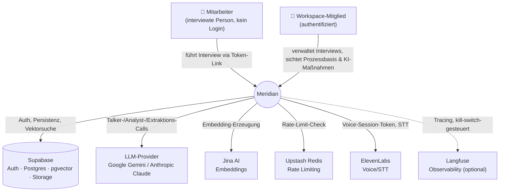
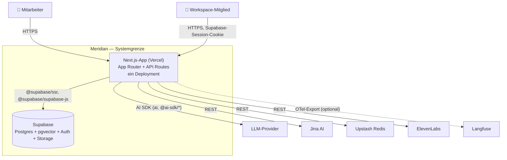

# 02 — Kontext & Container (C4 Level 1 + 2)

**Zweck:** Systemgrenze und externe Abhängigkeiten (Level 1), sowie die deploybaren Laufzeit-Einheiten innerhalb der Systemgrenze (Level 2). Component-Deep-Dives (Level 3) folgen in eigenen Dateien, siehe [`01-woerterbuch.md`](01-woerterbuch.md) für die Component-Liste.

Namensgebung der Akteure und Systeme ist gegen den Code geprüft, nicht aus dem PRD übernommen — Details und Begründung siehe Prosa unter jedem Diagramm. Dieses Dokument beschreibt den **Ist-Stand**; Vision, Zielgruppen (Marktpersonas) und Non-Goals stehen bereits in [`docs/PRD.md`](../PRD.md) und werden hier nicht dupliziert. Vorgeschlagene Erweiterungen, die über den Ist-Stand hinausgehen, stehen in [`00-vorgeschlagene-anpassungen.md`](00-vorgeschlagene-anpassungen.md).

---

## Level 1 — Context

### Akteure

- **Mitarbeiter** — die interviewte Person. Kein Login, greift ausschließlich über einen tokenisierten Einmal-Link (`app/interview/[token]/page.tsx`, Auth via `access_token`-Spalte + Expiry-Check, nicht via Supabase-Session) auf das System zu.
- **Workspace-Mitglied** — authentifizierter Nutzer des Dashboards (`app/dashboard/*`). Bewusst *nicht* "Admin" genannt: `workspace_members` ([`database.types.ts:35`](../../src/lib/database.types.ts#L35)) hat keine `role`-Spalte, und PROJ-10 legt explizit "gleichberechtigten Zugriff, keine hierarchische Rollen-Trennung" fest — heute sind alle Workspace-Mitglieder (aktuell Lias, Bendewar) im Code ununterscheidbar, es gibt nur einen gemeinsamen Workspace. Ein Rollenmodell mit **Admin** (workspace-übergreifender Zugriff) und **Projektverantwortliche(r)** (Zugriff auf genau einen Kunden-Workspace) ist eine vorgeschlagene Erweiterung, noch nicht gebaut — siehe [`00-vorgeschlagene-anpassungen.md`](00-vorgeschlagene-anpassungen.md), Eintrag 2. Diese Datei wird aktualisiert, sobald die Erweiterung umgesetzt ist.

Für Marktpersonas (warum jemand Meridian nutzt) siehe `docs/PRD.md` Target Users — eine andere Achse als die In-App-Rechte-Rollen hier, kein Widerspruch (z.B. kann ein Berater die Admin-Rolle innehaben).

### Externe Systeme (produktiv aktiv)

| System | Zweck | Grounding |
|---|---|---|
| **Supabase** | Auth, Postgres-Datenhaltung, pgvector-Vektorsuche, Storage | `lib/{supabase,supabase-server,supabase-admin}.ts` |
| **LLM-Provider** (Google Gemini primär, Anthropic Claude als Alternative) | Talker/Analyst-Calls, Extraktion, Enrichment, Use-Case-Generierung | einziger Dispatch-Punkt: `resolveModel()` in [`lib/llm-provider.ts:69`](../../src/lib/llm-provider.ts#L69), Provider-Wahl über `INTERVIEW_MODEL`/`EXTRACTION_MODEL`/`ENRICHMENT_MODEL` |
| **Jina AI** | Embedding-Erzeugung für Wissensobjekte/Prozessschritte | `services/embeddings.ts:15`, Modell `jina-embeddings-v3` (PROJ-14) |
| **Upstash Redis** | Rate Limiting auf Token-/Auth-Endpunkten | `lib/ratelimit.ts` |
| **ElevenLabs** | Voice/STT (Scribe v2 Realtime) für den Mitarbeiter-Interview-Input | `app/api/interview/[token]/voice-token/route.ts` |
| **Langfuse** | LLM-Observability/Tracing, Kill-Switch-gesteuert | `lib/langfuse.ts:30` (`LANGFUSE_ENABLED !== 'true'` → No-Op), gewired über OTel-SpanProcessor in `instrumentation.ts` |

**Fußnote — nicht als Hauptbox, weil nicht produktiv aktiv:** `resolveModel()` verdrahtet zusätzlich **Nebius** (EU-Route, PROJ-9, aktuell nicht Default) und **Fireworks** (manueller Fallback, kein automatisches Failover) als Provider-Optionen, sowie **OpenRouter** ausschließlich für lokale Eval-Läufe (`.env.local.example:37-44`: *"NEVER set a prod MODEL var to openrouter/…"*). Technisch wired, aber kein Teil der Prod-Kontextgrenze.

**Form-Konvention in den Diagrammen:** Zylinder (`[(...)]`) = hält für Meridian persistente Business-Daten (aktuell nur Supabase). Rechteck = externer Dienst ohne Meridian-Geschäftsdaten — auch wenn intern selbst eine Datenbank, wie Upstash Redis (hält nur ephemere Rate-Limit-Zähler, kein Business-State).

---

## Level 2 — Container

**Kriterium (C4):** ein Container ist eine separat lauffähige/deploybare Laufzeit-Einheit — eigener Prozess, eigener Deployment-Lifecycle, ggf. eigener persistenter State. Nicht zu verwechseln mit "Modul" (das ist Level 3 Component, siehe Wörterbuch). Nach diesem Kriterium hat Meridian genau **zwei** Container:

1. **Next.js-App** (Vercel) — App Router + API Routes in einem Repo, einem Build, einem Deployment. Bedient sowohl das Mitarbeiter-Interview (`app/interview/[token]`) als auch das Workspace-Dashboard (`app/dashboard/*`) aus derselben Laufzeit-Einheit.
2. **Supabase** — eigene Postgres-Runtime mit pgvector-Extension, eigener Auth-Dienst, eigener Storage; einziger persistenter State-Halter des Systems.

Die externen Systeme aus Level 1 sind **keine Container** (nicht Teil des deploybaren Systems, nur über Netzwerk angesprochen), erscheinen hier nochmal mit Protokoll-Detail.

