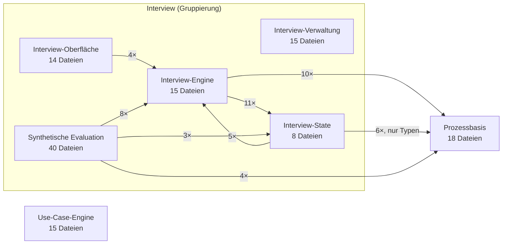

# 03 — Komponenten-Übersicht (C4 Level 3, systemweit)

**Zweck:** Die Aggregationsebene zwischen Level 2 (2 Container) und den einzelnen Component-Deep-Dives. Zeigt alle Components innerhalb des Next.js-App-Containers und wie sie tatsächlich voneinander abhängen — nicht behauptet, sondern aus dem Import-Graph abgeleitet. Component-Deep-Dives (mit eigenem internen Übersichtsdiagramm je Component) folgen in eigenen Dateien ab `04-*`.

## Methodik (Grounding)

Kanten sind **nicht** aus dem Gedächtnis gezeichnet. Ablauf:

1. `npx madge --json --ts-config tsconfig.json --extensions ts,tsx --exclude '\.test\.(ts|tsx)$' src` — vollständiger Datei-Import-Graph, 187 Dateien (Rest sind Tests, per Exclude draußen).
2. Jede Datei per Skript gegen die Zuordnungsregeln aus [`01-woerterbuch.md`](01-woerterbuch.md) gemappt (0 unmapped Dateien nach Korrektur zweier Skript-Bugs — `database.types.ts`/`use-toast.ts` erst falsch, dann korrekt erkannt).
3. Datei-Kanten auf Component-Ebene aggregiert, Kanten *innerhalb* derselben Component verworfen (die zeigen die internen Übersichtsdiagramme der Deep-Dives, nicht dieses Dokument).

Rohes Skript + Zwischenergebnis bei Bedarf reproduzierbar, nicht Teil des Repos (Scratch-Artefakt).

## Diagramm

Gezeigt werden nur Kanten zwischen den 7 fachlichen Components. **Infrastruktur**, **Geteiltes Fundament** und das Crosscutting Concept `_telemetry` sind bewusst ausgeblendet — praktisch jede Component importiert davon (DB-Client, Rate-Limiting, UI-Bausteine), das Einzeichnen aller dieser Kanten hätte nur Rauschen erzeugt und die eigentlich interessanten Business-Logic-Kanten verdeckt. Diese drei bleiben trotzdem "unsichtbare Basisabhängigkeit jeder Component" — siehe `01-woerterbuch.md`.

*Kantenzahlen Stand nach Korrektur-Runde 2026-07-13 (`slotConflictResolver.ts` → Interview-State, `interviewSemantic.ts` → Crosscutting, siehe unten) — vor der Korrektur zeigte diese Kanten IE→IS 10×, IS→IE 13×, PB→IE 2× zusätzlich, alle über die zwei jetzt umklassifizierten Dateien.*

## Kanten im Detail

| Von → Nach | Beispiel-Import | Charakter |
|---|---|---|
| Interview-Oberfläche → Interview-Engine | `app/interview/[token]/page.tsx` → `services/interviewTypes.ts` | Typen für den Client-State, keine Business-Logik |
| Interview-Engine → Interview-State | `services/interviewAgent.ts` → `services/turnStore/port.ts` (Ports, erwartete Richtung) + `services/slotConflictResolver.ts` (der Legacy-Pfad importiert das jetzt in Interview-State geführte Modul zurück) | Größtenteils erwartet, ein Teil ist die Legacy-Pfad-Rückkante |
| Interview-Engine → Prozessbasis | `app/api/interview/[token]/reconnect/route.ts` → `services/extraction.ts` | Extraktions-Trigger aus dem Interview-Flow |
| Interview-State → Interview-Engine | `services/turnStore/intents.ts` → `services/interviewTypes.ts` | Typen für Intent-Payloads, keine Business-Logik mehr (vor der Korrektur lief die Hauptmasse dieser Kante über `slotConflictResolver`/`interviewSemantic`, beide jetzt umklassifiziert) |
| Interview-State → Prozessbasis | `services/turnStore/applyIntent.ts` → `import type { RawExtraction } from '@/services/extraction'` | Nur Typ-Import, keine Laufzeit-Kopplung |
| Synthetische Evaluation → Interview-Engine/-State/Prozessbasis | `services/__evals__/interview/evalStore.ts` → diverse | Erwartet — der Eval-Runner treibt echte Turns/Extraktion |

**Ohne Kanten zu anderen Components:** Interview-Verwaltung (reines CRUD auf `interviews`, keine Business-Logik-Berührung) und Use-Case-Engine (liest `process_steps`/`process_clusters` ausschließlich direkt über Supabase, kein einziger Code-Import von Prozessbasis-Dateien — die Kopplung läuft komplett über die gemeinsame Datenbank, nicht über den Import-Graph. Für madge unsichtbar, für die Architektur trotzdem real).

## Drei Funde — Klärung 2026-07-13, alle umgesetzt

1. **`slotConflictResolver.ts`**: Interview-Engine → Interview-State. Nur 3 Importeure systemweit (`interviewAgent.ts` Legacy-Pfad, `turnStore/applyIntent.ts`, `turnStore/intents.ts`), kein Importeur aus dem aktiven Engine-Kern; die Datei heißt "Konfliktauflösung" — genau Interview-States eigene Aufgabenbeschreibung. **Umgesetzt** in `01-woerterbuch.md`, inkl. Umzug der zwei zugehörigen quellenlosen Tests.
2. **`interviewSemantic.ts`**: Interview-Engine → zweites Crosscutting Concept neben `_telemetry.ts`. 35 Importeure quer durch praktisch alle Components. **Umgesetzt** in `01-woerterbuch.md`.
3. **`stepIdentity.ts`**: Nutzerauftrag war "prüfen, ob Legacy-Code + `stepIdentity.ts` gelöscht werden kann". **Ergebnis: nein, nicht löschbar** — ursprüngliche Vermutung (nur 1 Importeur → Legacy → löschbar) war falsch, importer-count allein war irreführend, ohne zu prüfen ob `interviewAgent.ts` selbst erreichbar ist. Tatsächlich bündelt `interviewAgent.ts` zwei Dinge: `buildTools()` (aktiv, `interviewAnalyst.ts` UND `interviewQuickExtract.ts` importieren es; der `register_step`-Tool darin ruft `stepIdentity.ts`s `classifyStepSimilarity`/`generateMissingEmbeddings` bei jeder Schritt-Registrierung auf — aktive Deduplizierungslogik, Linie zu KI-2) und `createInterviewStream()` (aktiv via `start/route.ts` bei **jedem** Interview-Kaltstart, tot via `reconnect/route.ts` — dort nachweislich unerreichbar, `history` endet strukturell immer mit `role:'assistant'`, KI-22-Kommentar in `reconnect/route.ts:98-108`). Bleibt bei Interview-Engine im Wörterbuch — keine Korrektur nötig, nur die Lösch-Prämisse war falsch. Tatsächlich toter Code (klein, sicher entfernbar) + eine größere Anschlussfrage (sollte die `isStart`-Begrüßung über `runInterviewTurn.ts` statt über den separaten Pfad laufen, verwandt mit PROJ-37 Static-Prompt-Drift) als Eintrag 3 in [`00-vorgeschlagene-anpassungen.md`](00-vorgeschlagene-anpassungen.md) festgehalten, noch nicht umgesetzt.
