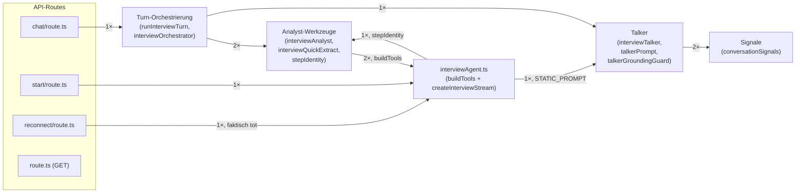
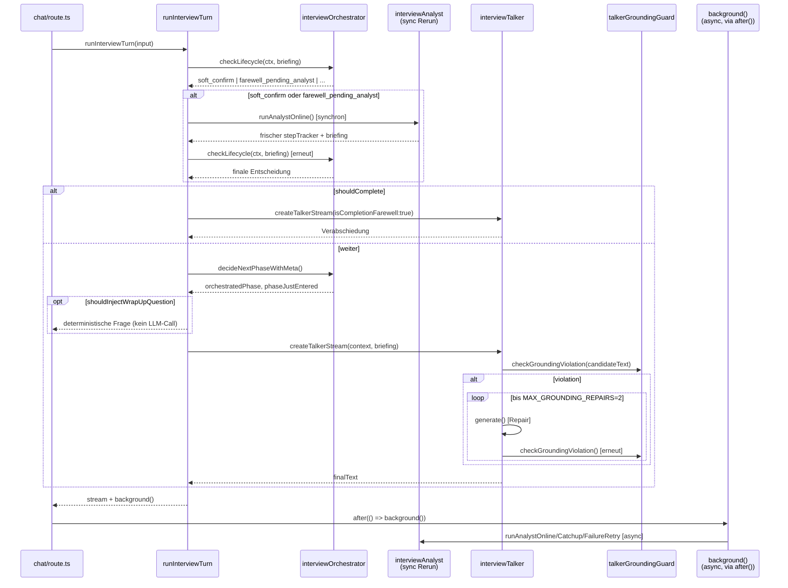
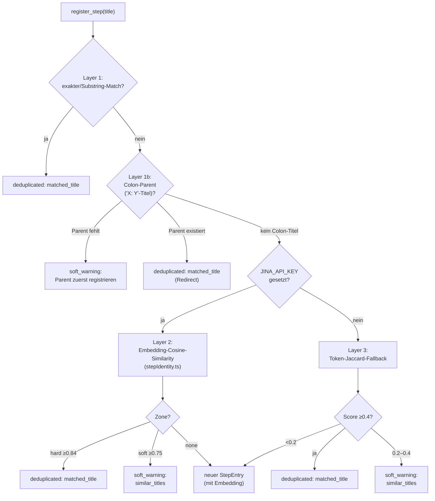

# 04 — Component-Deep-Dive: Interview-Engine

**Zweck:** Level-3-C4-Deep-Dive für die Component "Interview-Engine" (siehe [`01-woerterbuch.md`](01-woerterbuch.md) für die Code-/Modul-Zuordnung, [`03-komponenten-uebersicht.md`](03-komponenten-uebersicht.md) für die Einordnung im Gesamtsystem). Erste Component-Deep-Dive-Datei im Doku-Baum — folgt dem in [`00-methodik-component-deep-dives.md`](00-methodik-component-deep-dives.md) verbindlich festgehaltenen 7-Abschnitte-Template samt der vier dort dokumentierten Regeln (Zweck-Sätze, Funktionstabellen-Vollständigkeit, Neu-Verdrahtungs-Framework, Known-Issues-Residualrisiko-Check).

**Grounding:** Jede Funktionstabelle, jeder Zeilenverweis und jede Kritik in diesem Dokument wurde gegen den tatsächlichen Code (nicht nur gegen Recherche-Zusammenfassungen) verifiziert — Methodik dazu siehe [`00-methodik-component-deep-dives.md`](00-methodik-component-deep-dives.md). Stand: 2026-07-13, alle 15 Dateien der Component. **Nachtrag 2026-07-14:** Abschnitt 7.2 um Anpassungs-Einträge #19-22 ergänzt (reine Konsolidierung bereits bestehender Funde, keine neue Datei-Recherche in dieser Component).

---

## 1. Verantwortung

Die Interview-Engine führt den Dialog eines laufenden Interviews: sie entscheidet pro Turn, welche Frage als nächstes gestellt wird, wann die Phase wechselt und wann das Interview endet — nach dem Dual-Loop-Prinzip (ADR-011): ein sichtbarer **Talker** generiert live Text, während ein unsichtbarer **Analyst** im Hintergrund (`after()`) strukturiertes Wissen extrahiert und dem Talker für den nächsten Turn ein Briefing hinterlässt. Die Engine stellt außerdem das komplette Werkzeug-Set bereit, mit dem Wissen in den Step-Tracker geschrieben wird (`register_step`, `record_slot`, `record_governance`, `record_dependency`, `link_bottleneck`, `update_walkthrough_data`).

Explizit **nicht** Aufgabe der Interview-Engine:
- **Persistenz und Konfliktauflösung** — wer welchen Slot wann überschreiben darf, Race-Conditions, das TurnStore-Protokoll selbst: das ist Interview-State (`services/turnStore/*`, `slotConflictResolver.ts`).
- **Extraktion/Clustering von Prozesswissen in Dashboard-taugliche Form** — das übernimmt Prozessbasis (`extraction.ts`, `processEnrichment.ts`, `processClustering.ts`), von der Engine nur über die injizierten `extractAndEmbed`/`onCompleted`-Ports aus `runInterviewTurn.ts` angestoßen.
- **Rendering der Chat-Oberfläche** — das ist Interview-Oberfläche (`components/interview/*`).

## 2. Schnittstellen

**Haupt-Seam:** `runInterviewTurn(input: RunTurnInput, ports?: RunTurnPorts): Promise<TurnResult>` ([runInterviewTurn.ts:152](../../src/services/runInterviewTurn.ts#L152), ADR-016). Einziger Aufrufer in Produktion: `POST /api/interview/[token]/chat` ([chat/route.ts:115-120](../../src/app/api/interview/[token]/chat/route.ts#L115)). Der Eval-Runner (`__evals__/interview/runner.ts`) ist der zweite Aufrufer, mit injizierten Test-Ports statt `defaultProdPorts()`.

**Architektonische Besonderheit — zwei parallele Einstiegspunkte:** `start/route.ts` und `reconnect/route.ts` rufen **nicht** `runInterviewTurn`, sondern direkt die ältere `createInterviewStream()` aus `interviewAgent.ts` auf. Es gibt also zwei unabhängige "Turn-Ausführer" in der Codebase — der ADR-016-Seam für reguläre Chat-Turns, ein separater, älterer Pfad für den allerersten Turn (Opener) und (inzwischen faktisch nie mehr erreichter, siehe Abschnitt 4.4) Reconnect-Turn. Das ist keine Vereinheitlichung, sondern eine bewusst offen gelassene Architekturfrage (siehe Anpassungs-Eintrag #3, verwandt mit PROJ-37).

**Berührte DB-Tabellen** (nur Lese-/Update-Zugriffe innerhalb der Engine selbst — Inserts von Turns/Slots laufen über den vom Interview-State-Layer bereitgestellten `InterviewStore`/`TurnSession`):
| Tabelle | Zugriff innerhalb der Engine |
|---|---|
| `interviews` | Lesen (Kontext, `analyst_status`, `next_briefing`), Update (`analyst_status`, `next_briefing`, Completion via `store.completeInterview`) |
| `interview_state` | Lesen (Phase, Step-Tracker, Topics), Update (Phase-Wechsel, `opener_text`) |
| `turns` | Lesen (History-Aufbau, Timer-Berechnung), Insert (via `store.insertTurn`, in `runInterviewTurn.ts`s `onFinish`) |

## 3. Übersichtsdiagramm

Interner Abhängigkeitsgraph der 15 Dateien, aggregiert auf 6 Verantwortungsgruppen. Kanten aus dem systemweiten madge-Graph (`npx madge --json --ts-config tsconfig.json --extensions ts,tsx --exclude '\.test\.(ts|tsx)$' src`), gefiltert auf Kanten innerhalb der Component, nicht aus dem Gedächtnis gezeichnet. `interviewTypes.ts` (reine Typdatei, von praktisch jeder anderen Datei importiert) ist wie beim systemweiten Diagramm als impliziter Unterbau ausgeblendet, um die eigentlich interessanten Kanten nicht zu verdecken.



**Bemerkenswerter Befund:** Analyst-Werkzeuge und `interviewAgent.ts` sind wechselseitig gekoppelt — `interviewAnalyst.ts`/`interviewQuickExtract.ts` importieren `buildTools` aus `interviewAgent.ts`, das wiederum `classifyStepSimilarity`/`generateMissingEmbeddings` aus `stepIdentity.ts` (Teil der Analyst-Werkzeuge-Gruppe) importiert. Kein Datei-Zyklus (die beteiligten Dateien sind verschieden), aber ein Gruppen-Zyklus — Ausdruck davon, dass `interviewAgent.ts` architektonisch eher ein geteilter Tool-Kernel ist als eine eigenständige Verantwortungsgruppe (siehe 4.3/4.4).

## 4. Code-Walkthrough

**Hinweis (2026-07-14):** Dieser Abschnitt beschreibt den Stand vor der Cleanup-Tranche 2026-07-14 — u.a. listen die Funktionstabellen unten weiterhin `allStepsDone`/`allMandatorySlotsFilled`/`findStepFuzzy`/`findStepById` (inzwischen gelöscht, #4/#5) und `ExtractAndEmbedArgs.transcript` (inzwischen zu `userInput` verengt, #17) als Ist-Stand. Verbindlicher, laufend aktueller Status pro Fund steht in [`00-vorgeschlagene-anpassungen.md`](00-vorgeschlagene-anpassungen.md); Nachholen dieses Abschnitts ist Teil von Meilenstein 4 (Doku-Fortsetzung), nicht in dieser Session.

Gliederung nach Verantwortungsgruppen, nicht alphabetisch. `interviewAgent.ts` wird entlang seiner zwei unterschiedlich erreichbaren Teile in zwei separate Unterabschnitte behandelt (4.3 `buildTools()`, 4.4 `createInterviewStream()`) statt als ein Block — die beiden Hälften der Datei haben nichts Gemeinsames außer demselben Dateinamen.

**Regel für die Funktionstabellen** (Nutzer-Rückfrage, geklärt bei dieser Überarbeitung): jede benannte Funktion mit eigener Logik bekommt eine Zeile — unabhängig davon, ob sie auf Modul-Ebene steht oder in einer anderen Funktion verschachtelt ist. Ausnahme: anonyme Ein-Zeiler ohne eigenständige Logik (z.B. ein einzeiliges `.map()`-Callback) werden nur in der Ablauf-Prosa erwähnt, nicht tabellarisch. Diese Regel wurde retroactiv gegen alle 15 Dateien per Grep geprüft (jede `function`/`const =>`-Deklaration einzeln gezählt und mit der jeweiligen Tabelle abgeglichen); zwei Lücken kamen dabei zutage und wurden ergänzt: `fmtPotenzial`/`fmtTazite` (verschachtelt in `formatStepTracker`, siehe 4.2.2) und die sieben einzelnen Tool-Funktionen innerhalb von `buildTools()` (siehe 4.3, eigene Tabelle statt nur Prosa-Erwähnung — sie sind das in Abschnitt 1 genannte Werkzeug-Set, architektonisch der wichtigste Teil der Datei).

### 4.1 Turn-Orchestrierung

#### `runInterviewTurn.ts` (576 Zeilen) — der ADR-016-Seam

**Zweck (einfach):** der zentrale Taktgeber für jeden Chat-Turn — lädt den bisherigen Gesprächsstand, entscheidet ob das Interview weitergeht oder endet, ruft den Talker für die sichtbare Antwort auf und stößt den Analysten im Hintergrund an.

**Element-Übersicht** (vier Kategorien statt einer flachen Tabelle, siehe Methodik-Regel 6 — Details je Kategorie in den Unterabschnitten danach):

| Element | Kategorie | Exp./Intern | Zeile |
|---|---|---|---|
| `defaultProdPorts()` | Modul-Funktion | intern | 66 |
| `makeWrapUpStream(text)` | Modul-Funktion | intern | 141 |
| `runInterviewTurn(input, ports)` | Modul-Funktion (Haupt-Seam) | exportiert | 152 |
| `ExtractAndEmbedArgs` | Typdeklaration (`interface`) | exportiert | 46 |
| `RunTurnPorts` | Typdeklaration (`interface`) | exportiert | 53 |
| `TurnStream` | Typdeklaration (`interface`) | exportiert | 95 |
| `OnTokenUsage` | Typdeklaration (`type`, Funktionssignatur) | intern | 101 |
| `RunTurnInput` | Typdeklaration (`interface`) | exportiert | 109 |
| `TurnMeta` | Typdeklaration (`interface`) | exportiert | 119 |
| `TurnResult` | Typdeklaration (`interface`) | exportiert | 126 |
| `SEED_FILLERS` | Konstante | intern | 134 |
| `background` (Completion-Zweig) | Closure | intern | 307–348 |
| `onFinish`-Callback an `createTalkerStream` | Closure | intern | 446–486 |
| `runPostCompletionTasks` | Closure | intern | 458–462 |
| `background` (Normal-Zweig) | Closure | intern | 490–564 |

**Typdeklarationen** (Daten/Zweck/Notwendigkeits-Gegenprobe pro Regel 5):

- **`ExtractAndEmbedArgs`** (Z.46-51) — *Daten:* `interviewId`/`workspaceId`/`turnId` werden 1:1 in die entsprechenden Spalten von `knowledge_objects` geschrieben ([extraction.ts:131-136](../../src/services/extraction.ts#L131)); `transcript` wird bei jedem Turn frisch aus der gesamten bisherigen Historie gebaut ([runInterviewTurn.ts:465-468](../../src/services/runInterviewTurn.ts#L465)). *Zweck:* Argument-Schnittstelle für den `extractAndEmbed`-Port. *Gegenprobe (Fund):* zwei Probleme statt keinem. (1) `buildExtractionPrompt` ([extraction.ts:49-52](../../src/services/extraction.ts#L49)) liest von `transcript` ausschließlich `transcript[transcript.length-1]` — der Rest wird bei jedem Aufruf konstruiert und verworfen, O(n) mit der Interviewlänge. (2) `ExtractAndEmbedArgs` selbst hat grep-verifiziert keinen externen Importeur (nur `RunTurnPorts` referenziert es). Beides dokumentiert als **Anpassungs-Eintrag #17** (Overhead / unnötige Schnittstellenfläche), Quellcode-Kommentar an Ort und Stelle ergänzt.
- **`RunTurnPorts`** (Z.53-60) — *Daten:* bündelt `store` (Persistenz, siehe `InterviewStore` in `turnStore/port.ts`), `extractAndEmbed` (s.o.), `onCompleted` (Post-Completion-Pipeline). *Zweck:* ADR-018-Vertrag — ein einziges Objekt statt drei Einzelparameter, damit Prod (`defaultProdPorts()`) und Eval (`evalStore.ts:285-289`) denselben benannten Typ erfüllen, ohne einander zu kennen. *Gegenprobe:* verifiziert über `evalStore.ts` — der Eval-Runner baut genau dieses Interface komplett eigenständig auf (Store durch PGlite ersetzt, `extractAndEmbed`/`onCompleted` als No-Ops). Bündelung ist begründet, kein Fund.
- **`TurnStream`** (Z.95-99) — *Daten:* `{ toTextStreamResponse(), text: PromiseLike<string> }`. *Zweck:* laut Datei-Kommentar (Z.91-93) die einzige Form, die sowohl das echte `streamText`-Ergebnis als auch `makeWrapUpStream`s Fake-Objekt erfüllen können. *Gegenprobe:* könnte man stattdessen den echten `StreamTextResult`-Typ der `ai`-Bibliothek verwenden? Nein — `makeWrapUpStream` ruft kein LLM auf und könnte dessen übrige Felder nicht füllen. Die schmale Form ist notwendig, kein Overhead.
- **`OnTokenUsage`** (Z.101-107) — *Daten:* `{ component, model, inputTokens, cacheReadTokens?, outputTokens }`, an jeder Stelle über `opts.onTokenUsage?.(...)` aufgerufen (`interviewTalker.ts:237,293`, `talkerGroundingGuard.ts:195`, `interviewQuickExtract.ts:195`, `interviewAnalyst.ts:522,632`). *Zweck:* Kosten-/Token-Tracking pro LLM-Call. *Gegenprobe:* grep-verifiziert übergibt `chat/route.ts` (Prod) niemals ein `onTokenUsage` — nur der Eval-Runner befüllt es (`runner.ts:1177-1193`, Kosten-Aggregation pro Lauf). Kein Fund: ein für einen von zwei Aufrufern ungenutztes optionales Feld kostet nichts, anders als der `ExtractAndEmbedArgs`-Fund oben, wo aktiv Daten aufgebaut werden, die niemand braucht.
- **`RunTurnInput`** (Z.109-117) — *Daten:* `interviewId`, `userInput`, `timerMinutes`, `traceCtx?`, `onTokenUsage?`. *Zweck:* `timerMinutes` wird laut Kommentar (Z.99-101 in `chat/route.ts`) bewusst außerhalb berechnet ("HTTP concern"), damit `runInterviewTurn` ohne Zeit-Mocking testbar bleibt — verifiziert: `chat/route.ts:102-112` berechnet es aus `Date.now()` minus erstem Turn-Timestamp, der Eval-Runner simuliert einen künstlichen Wert. *Gegenprobe:* könnte die Funktion `Date.now()` selbst aufrufen? Technisch ja, aber jeder Eval-Test bräuchte dann Zeit-Mocking für deterministische Turn-Budget-Tests. Die Injektion ist der bewusste Preis für Testbarkeit.
- **`TurnMeta`/`TurnResult`** (Z.119-130) — *Daten:* `phase`, `completed`, `reason`, `stepTracker`. *Zweck:* Kurz-Zusammenfassung des Turn-Ergebnisses. *Gegenprobe:* `meta` wird bei jedem Turn berechnet, aber `chat/route.ts` liest `.meta` an keiner Stelle (nur `.stream`/`.background`) — einziger Konsument ist der Eval-Runner (`runner.ts:904,908`). Wie bei `OnTokenUsage`: normale Ports-Asymmetrie, kein Overhead, da die Werte (`phase`, `stepTracker`) ohnehin bereits im Speicher liegen.

**Konstanten:**

- **`SEED_FILLERS`** (Z.134-138) — *Daten:* 11 feste Floskel-Strings. *Zweck:* Startwert für die "bitte nicht wiederholen"-Liste (`usedFillerPhrases`), wenn `persistedFillers.length===0` (Z.190-193). *Gegenprobe, Teil 1 (Mutations-Risiko):* da `const` nur die Bindung schützt, nicht den Array-Inhalt, geprüft ob irgendein Konsument `.push()`/`.splice()` darauf aufruft und damit das modulweite Array prozessweit über Interviews hinweg verändern würde — verifiziert über `talkerPrompt.ts:446` (`ctx.usedFillerPhrases?.slice(-8)`, nicht-mutierend). Kein Fund. *Gegenprobe, Teil 2 (Fallback-Häufigkeit, der eigentlich gewichtige Fund):* die Bedingung `persistedFillers.length===0` sollte nur bei Turn 1 zutreffen — Nachverfolgung zeigt aber, dass der Talker `usedFillerPhrases` per Read-Merge-Write persistiert (`interviewTalker.ts:312-336`), während der Analyst `next_briefing` bei jedem `produce_briefing`-Aufruf als vollständigen Spalten-Ersatz committet (`interviewAnalyst.ts:463-478` → `applyIntent.ts:425` → `supabaseTurnStore.ts:111-119`, reines `.update(fields)` ohne JSONB-Merge) — `AnalystBriefingSchema` (`interviewAnalyst.ts:69-78`) hat kein `usedFillerPhrases`-Feld und kann es folglich nie mitschreiben. Läuft der asynchrone Analyst-Commit zeitlich nach dem Talker-Write (Normalfall via `after()`), wird die akkumulierte Liste komplett überschrieben. Dokumentiert als **Anpassungs-Eintrag #18** (funktionaler Bug-Verdacht — Code-Pfad vollständig verifiziert, Laufzeit-Verifikation steht noch aus), Quellcode-Kommentar an der Fallback-Stelle ergänzt.

**Modul-Funktionen** (die zwei Helfer; `runInterviewTurn` selbst siehe Ablauf-Absatz danach):

- **`defaultProdPorts()`** (Z.66-86) — *Daten:* baut `store` (`createSupabaseInterviewStore()`), `extractAndEmbed` (Wrapper um `extraction.extractAndEmbed`), `onCompleted` (awaitet `createProcessStepsFromTracker`, schickt Clustering + Dedup als Fire-and-Forget hinterher). *Zweck:* Prod-Default, falls `runInterviewTurn` ohne eigene `ports` aufgerufen wird (nur `chat/route.ts` in der Praxis). *Gegenprobe:* warum `await import(...)` statt normalem Top-Level-Import? Verifiziert über `supabaseTurnStore.ts:9-10`s eigenen Kommentar: "Never imported by the eval (tsx) path". Ein statischer Import würde diese Invariante allein durchs Laden von `runInterviewTurn.ts` (das der Eval-Runner ohnehin importieren muss) verletzen. Geprüft, ob das zusätzlich hart crashen würde: `supabase-admin.ts` importiert `server-only`, dessen echtes `index.js` unconditionally wirft (`node_modules/server-only/index.js`) — außer die `"react-server"`-Export-Condition greift (`node_modules/server-only/package.json`, mappt dann auf `empty.js`). Die Eval-Scripts laufen mit `tsx --conditions react-server` (`package.json:17`), das neutralisiert den Crash-Pfad technisch. Die Lazy-Import-Entscheidung ist also weniger "sonst crasht es zwingend" und mehr eine bewusste, harte Entkopplungs-Invariante, unabhängig von der aktuellen Flag-Konstellation — sinnvoll und nötig als Design-Entscheidung, nicht Zufallsprodukt einer Flag.
- **`makeWrapUpStream(text)`** (Z.141-148) — *Daten:* ein fester Text. *Zweck:* `shouldInjectWrapUpQuestion` (Z.372) entscheidet, ob die feste Wrap-up-Frage gestellt wird; dieser Shim spart dafür einen kompletten LLM-Call. *Gegenprobe:* ließe sich das nicht über den normalen Talker-Pfad mit hart vorgegebenem Prompt erzwingen? Möglich, aber mit echtem LLM-Call (Kosten, Latenz, Risiko einer Umformulierung). Der Shim ist die günstigere, deterministische Variante für eine Frage, die ohnehin wortgleich sein muss.

**Closures** (siehe Methodik-Regel 6 — Funktionswerte, pro `runInterviewTurn`-Aufruf neu erzeugt, fangen den lokalen Zustand DIESES Aufrufs ein: `interview`, `store`, `history`, `currentLog`, `p`, `existingTurns`, `preCompletionAnalystResult`):

- **`background` (Completion-Zweig, Z.307-348)** — verhindert Doppel-Verarbeitung via `preCompletionAnalystResult`-Check; B5-Fallback für `hard_stop`.
- **`onFinish`-Callback an `createTalkerStream` (Z.446-486)** — persistiert den Turn, aktualisiert State, verkettet Extraktion + Post-Completion.
- **`runPostCompletionTasks` (Z.458-462)**, selbst verschachtelt in `onFinish` — prüft `interviews.status==='completed'` und ruft `ports.onCompleted`.
- **`background` (Normal-Zweig, Z.490-564)** — wählt Online-/Catchup-/FailureRetry-Analystenlauf je nach `analystStatus`/`phaseJustEntered`.

Die zwei `background`-Varianten sind der konkrete Beleg dafür, warum Closures eine eigene Dokumentations-Kategorie verdienen: es sind keine zwei Aufrufe derselben Funktion, sondern zwei unabhängig geschriebene Funktionswerte mit je eigenem eingefangenen Zustand — deshalb konnte sich dieselbe Dedup-Prüfung (`preCompletionAnalystResult`) unbemerkt verdoppeln (Anpassungs-Eintrag #15, Quellcode-Kommentar an beiden Stellen ergänzt).

**Ablauf (`runInterviewTurn`):** Interview laden (L158–161, wirft bei Nichtfund) → State+Turns parallel laden (L164–167) → History aufbauen inkl. Opener-Injektion für Turn 1 (B2, L179–183) → `checkLifecycle` (L208, erster Cross-File-Call zu `interviewOrchestrator.ts`) → bei `soft_confirm`/`farewell_pending_analyst` synchroner Analyst-Rerun + erneuter `checkLifecycle` (L210–263, siehe KI-12/14 unten) → bei `shouldComplete` skriptierter Farewell-Talker-Aufruf mit `isCompletionFarewell:true` (L265–361, überspringt Phasen-Entscheidung komplett) → sonst `decideNextPhaseWithMeta` (L364) → optionale deterministische Wrap-up-Injection ohne LLM-Call (L372–391) → Pre-Talker Quick-Extract (L394–408) → regulärer `createTalkerStream`-Aufruf (L424–487) → Rückgabe von `stream` + `background`-Closure, die der Route-Handler separat via `after()` plant.

**Kritische Einordnung** (Funde, die die Turn-Orchestrierung als Ganzes betreffen — Element-spezifische Funde stehen bereits oben bei den jeweiligen Typdeklarationen/Konstanten/Closures):
- **KI-12/KI-14 (L210–263)** — der ausführliche Kommentar (L210–224) erklärt exakt das Race-Condition-Problem: `stepTracker`/`analystBriefing` spiegeln den Stand vom Ende des VORHERIGEN Turns, der aktuelle `userInput` wurde noch von keinem Analyst-Pass gesehen. Der Fix erzwingt bei `soft_confirm`/`farewell_pending_analyst` einen synchronen `runAnalystOnline`-Call (L232–253), lädt den Tracker neu (L255–257) und ruft `checkLifecycle` erneut auf (L259). **Residualrisiko** (Anpassungs-Eintrag #8): Der `catch`-Block (L260–262) fängt einen Fehler im Rerun zwar ab und loggt ihn strukturiert (`console.error('[runInterviewTurn] pre-completion analyst recheck failed, trusting original lifecycle decision:', err)`), degradiert danach aber still auf die ursprüngliche, potenziell stale Lifecycle-Entscheidung — genau das Problem, das der Rerun beheben sollte, bleibt im eigenen Fehlerfall unadressiert. Das Logging existiert (kein stiller Fail), aber es gibt keinen harten Fallback (z.B. erzwungenes `hard_stop`) und keine Eskalation.
- **B5-Kommentar (L316–318)** dokumentiert einen separat behobenen Blindspot: beim `hard_stop`-Pfad lief nie ein Soft-Confirm-Recheck, der Analyst hätte sonst den letzten Turn verloren.
- **Inkonsistentes Error-Handling bei Fire-and-Forgets**: L419 (`setAnalystStatus`) schluckt Fehler komplett lautlos (`.then(() => {}, () => {})`, kein Logging), während die vergleichbaren Fire-and-Forgets in `defaultProdPorts` (L78–83) wenigstens `console.error` loggen. Gleiches Muster (asynchroner Nebeneffekt ohne Warten auf Ergebnis), unterschiedliche Sorgfalt.
- **`currentLog`-Snapshot (L421)** wird einmalig vor dem Talker-Call eingefroren und unverändert sowohl in den Talker-Kontext (L436) als auch in den `background`-Analyst-Kontext (L513) gereicht — die im selben Turn per `extractAndEmbed` neu gewonnenen Extraktionen (L475–479) landen erst asynchron in `updateStateAfterTurn`, nachdem `background()` bereits mit dem alten `currentLog` läuft. Das ist der praktische Anwendungsfall des in ADR-019 (Dual-Loop Snapshot-Freshness-Vertrag) formalisierten Verhaltens.
- **`OnTokenUsage`-Typ** ist strukturell identisch zu den gleichnamigen, unabhängig definierten Typen in `interviewTalker.ts` (L26–32) und `talkerGroundingGuard.ts` (L5–11) — dreifach dupliziert statt geteilt (Anpassungs-Eintrag #13).

#### `interviewOrchestrator.ts` (429 Zeilen)

**Zweck (einfach):** die Regelmaschine, die entscheidet, in welcher Phase sich das Interview gerade befindet und wann es enden darf — reine Entscheidungslogik ohne eigene LLM-Aufrufe, nur Prüfungen gegen den vorhandenen Zustand.

| Funktion/Konstante | Zweck | Exp./Intern | Zeile |
|---|---|---|---|
| `computeTurnBudget(maxDurationMinutes, stepCount)` | leitet alle HL-Eskalationsschwellen proportional aus `maxDurationMinutes` her (Pt6 TurnBudgetAllocator) | exportiert | 47 |
| `computeStepBudget(...)` | HL-Budget pro Walkthrough-Schritt vor Forced-Push | intern | 65 |
| `estimateTurnsUsedOnCurrentStep(...)` | schätzt bereits verbrauchte HL für den aktuellen Walkthrough-Schritt | intern | 77 |
| `hasStepInStatus(tracker, status)` | Prädikat, vielfach in `decideNextPhase`/`checkLifecycle` genutzt | intern | 85 |
| `walkthroughHasContent(tracker)` | prüft ob genug Walkthrough-Content vorliegt (Hauptpfad + 2 Fallbacks) | intern | 89 |
| `allStepsDone(tracker)` | **toter Code** — kein Aufrufer im gesamten Repo (grep-verifiziert) | intern (ungenutzt) | 107 |
| `semanticAllStepsDone(tracker)` | gruppiert semantisch äquivalente Schritte, prüft Potenzial-Slot-Vollständigkeit je Gruppe | intern | 114 |
| `hasUnexploredFocusTopic(...)` | prüft ob offene Fokusthemen noch nicht im Tracker registriert sind | intern | 123 |
| `allMandatorySlotsFilled(tracker)` | **toter Code** — kein Aufrufer im gesamten Repo (grep-verifiziert) | intern (ungenutzt) | 132 |
| `isUnstartedStep(step)` | KI-15: unterscheidet "gerade registriert, 0 Content" von "unvollständig nach echtem Fortschritt" | intern | 140 |
| `hasUnstartedExploringStep(tracker)` | Wrapper um `isUnstartedStep` für Status `exploring` | intern | 147 |
| `WRAP_UP_QUESTION_TEXT` | deterministische Wrap-up-Frage | exportiert (const) | 157 |
| `wrapUpQuestionAlreadyAsked(history)` | prüft ob die Frage bereits gestellt wurde (Substring-Match) | exportiert | 165 |
| `shouldInjectWrapUpQuestion(nextPhase, history)` | entscheidet ob dieser Turn die Frage injiziert statt den Talker zu rufen | exportiert | 181 |
| `assertPhaseInvariants(...)` | loggt Warnung (kein Throw) bei unter-gestarteten Schritten kurz vor Farewell | intern | 198 |
| `decideNextPhase(ctx, analystSuggestion)` | deterministische Phasen-State-Machine | exportiert | 223 |
| `PhaseDecisionMeta`, `decideNextPhaseWithMeta(...)` | Wrapper, signalisiert zusätzlich Phasen-Neueintritt | exportiert | 327, 341 |
| `checkLifecycle(ctx, analystSuggestion)` | Hard-Stop / Soft-Confirm / Farewell-Escape-Valve-Entscheidung | exportiert | 353 |

**Ablauf `decideNextPhase`** (L223–325): `switch` über `ctx.phase` — `intro` → `process_loop` (L242–249) → `walkthrough_step` (L251–270, Per-Step-Turn-Budget gegen Depth-First-Starvation) → `slot_completion` (L272–279) → `coverage_check` (L281–284) → `wrap_up` (L286–316, komplexester Case mit Push-back-Guard) → `clarification` (L318–320, bleibt bis der Route-Handler die DB prüft).

**Ablauf `checkLifecycle`** (L353–428): drei Trigger — Hard-Stop (L355–357, reiner Timer-Vergleich), Farewell-Loop-Escape-Valve (L359–406, phasen-agnostisch, MUSS vor dem Active-Step-Guard laufen laut Kommentar L363f), Trigger B / Soft-Confirm im `wrap_up` (L408–425).

**Kritische Einordnung:**
- **Toter Code bestätigt**: `allStepsDone` (L107–110) und `allMandatorySlotsFilled` (L132–134) sind definiert, nicht exportiert und werden nirgends im Repo aufgerufen (Anpassungs-Eintrag #5) — vermutlich Überbleibsel eines Refactors, den `semanticAllStepsDone` bzw. `computeMissingMandatorySlots` (aus `interviewSemantic.ts`) abgelöst haben.
- **Revert-Spur in `walkthroughHasContent`** (L97–98): "Fix-3 reverted: threshold back to 'any slot' (>= 1) to prevent depth-first starvation" — Beleg für iterative Bugfix-Historie, gleiche Problemklasse wie KI-15, aber ohne eigene KI-Nummer.
- **KI-15-Fix direkt lokalisierbar**: `isUnstartedStep`/`hasUnstartedExploringStep` (L136–149), konsumiert in `checkLifecycle` L389 als Veto gegen vorzeitige Completion.
- **Residualrisiko** (Anpassungs-Eintrag #9): `assertPhaseInvariants` wird bei JEDEM `decideNextPhase`-Aufruf berechnet (L233), aber die zurückgegebene `invariantViolated`-Flag wird nur im `walkthrough_step`-Case konsumiert (L260, `if (invariantViolated) return 'slot_completion'`) — nicht in `coverage_check` (L281–284) oder `wrap_up` (L286–316), obwohl der Invariant selbst über "farewell approaching" spricht (L199–209). Eine künftige Regression, die sich erst in `coverage_check`/`wrap_up` zeigt, würde diese Warnung nicht auslösen.
- **`wrap_up`-Case-Kommentar** (L287–289) ist ein explizites Warnschild: ohne den `escapeAlreadyFired`-Guard entsteht eine Endlosschleife `wrap_up → walkthrough_step → slot_completion → coverage_check → wrap_up → ∞`.
- **KI-14-Fix, konkret referenziert**: die Farewell-Loop-Escape-Valve (L359–406) zitiert direkt "eval 2026-06-25 run1, turn 29" (L401) für den `farewell_pending_analyst`-Zweig (L395–404) — eine bewusst simple, marker-basierte Heuristik (`FAREWELL_MARKERS`, L367, vier deutsche Substrings), abgesichert durch die Zwei-Farewell-in-Folge-Bedingung (L369, L372).
- **Redundante Parallel-Logik**: Trigger B in `checkLifecycle` (L408–425) und der `wrap_up`-Case in `decideNextPhase` (L304–314) prüfen unabhängig voneinander `wrapUpQuestionAlreadyAsked` + "letzte Message ist user" + `clarification_cards` — keine gemeinsame Helper-Funktion, muss synchron gehalten werden.

### 4.2 Talker

#### `interviewTalker.ts` (345 Zeilen)

**Zweck (einfach):** erzeugt die sichtbare Antwort des Interviewers — baut den Prompt zusammen, ruft das Sprachmodell auf und lässt die Antwort vor der Auslieferung an den Nutzer gegen Fabrikation prüfen (KI-18-Guard).

| Funktion/Konstante | Zweck | Exp./Intern | Zeile |
|---|---|---|---|
| `TALKER_THINKING_BUDGET` | fixer Thinking-Budget-Wert 512 (bewusst nicht 0) | exportiert (const) | 24 |
| `TalkerStreamOptions` | Options-Interface für `createTalkerStream` | exportiert (Type) | 34 |
| `detectNumberAnchoring(talkerText, suggestedQuestion)` | Pt7: erkennt ob der Talker Zahlen aus dem Briefing in einer Frage zurück-zitiert | exportiert | 55 |
| `FILLER_PATTERNS`, `QUESTION_TEMPLATE_PATTERNS` | Regex-Tabellen für Floskel-/Frageschablonen-Erkennung | intern (const) | 72, 100 |
| `detectFillerPhrases(text)` | Pt13/F1c/F1d: extrahiert Opener-Floskeln + Frageschablonen für die Avoidance-Liste | exportiert | 116 |
| `createTalkerStream(opts)` | Kernfunktion: Prompt-Aufbau, `generateText`, Grounding-Guard-Repair-Loop, Filler-Tracking | exportiert (async) | 135 |
| `generate(systemAddendum?)` | Closure: kapselt `generateText` mit fixem Thinking-Budget + Telemetrie | intern (Closure) | 197 |

**Ablauf:** Moduldoc (L10–20) begründet die zentrale Architekturentscheidung — **buffer-then-stream** (`generateText` statt `streamText`), damit der Grounding-Guard die Kandidatenantwort prüfen kann, bevor sie den Client erreicht. Signal-Felder aus der History extrahieren (L146–154) → `buildDynamicContext` aus `talkerPrompt.ts` (L155–158) → `baseMessages` je nach `isReconnect`/`isStart`/Normal aufbauen (L163–170) → `generate()` (L220) → Token-Logging (L223–244) → Anchoring-Detection nur zu Logging-Zwecken (L246–256) → **KI-18-Repair-Loop** (L258–310): `checkGroundingViolation` aus `talkerGroundingGuard.ts`, bei Violation bis zu `MAX_GROUNDING_REPAIRS=2`-mal neu generieren, jedes Mal erneut geprüft → Filler-Phrase-Persistierung direkt via `getSupabaseAdmin` (L312–336) → `onFinish`-Callback (L338, zurück zu `runInterviewTurn.ts`).

**Kritische Einordnung:**
- **Eigene, faktisch tote `isReconnect`-Verzweigung** (L163–167): `TalkerStreamOptions.isReconnect` (L38) wird zwar gelesen, aber **an keiner einzigen Aufrufstelle in der Codebase auf `true` gesetzt** (grep-verifiziert: `createTalkerStream` wird nur von `runInterviewTurn.ts` — zweimal, keine `isReconnect`/`isStart` — und vom Eval-Runner mit `isStart:true` aufgerufen). Das ist eine **zweite, unabhängige Kopie** desselben inzwischen unerreichbaren Zweigs, der bereits in `interviewAgent.ts` (Abschnitt 4.4) als tot dokumentiert ist — seit dem KI-22-Fix in `reconnect/route.ts` gibt es keinen produktiven Pfad mehr, der überhaupt einen Talker mit `isReconnect:true` aufruft. Weitet den Scope von Anpassungs-Eintrag #3 auf diese Datei aus.
- **KI-18 doppelt referenziert**: L264–267 dokumentiert explizit, dass das alte 1-Repair-Design "an unverified repair silently" auslieferte. L279–286 dokumentiert eine ZWEITE, spätere Regression durch die ursprüngliche Repair-Formulierung ("stelle eine neue Frage ohne Rückbezug"), quantifiziert mit "dialogNaturalness median 0.67→0.33 at seed 99".
- **Teilweise Redundanz zwischen zwei Detektionsmechanismen**: `detectNumberAnchoring` (L55–65) ist rein Logging (`console.warn`, L251), während `checkGroundingViolation` (Talker-Guard, Datei 4.2.3) dieselbe Fehlerklasse (Zahl-Fabrikation, GUARD_SYSTEM Fall 1) tatsächlich blockiert/repariert — zwei unterschiedliche Enforcement-Level für verwandte Probleme. Kommentar L53 ("Used in onFinish for observability logging") ist zudem leicht irreführend: der Call findet nicht innerhalb von `opts.onFinish` statt, sondern direkt im Funktionskörper (L249).
- **Ports-Bruch**: Filler-Persistierung (L312–336) schreibt direkt via `getSupabaseAdmin` statt über die `RunTurnPorts`/`InterviewStore`-Abstraktion (ADR-018) — strukturelle Inkonsistenz zum Rest der Pipeline, non-fatal (`try/catch` mit `console.error`, L333–335).
- **Latenz-Tail-Risiko unadressiert**: worst-case bis zu 3 sequentielle `generateText`-Calls im Talker (1 initial + 2 Repairs) plus bis zu je 2 Guard-Judge-Calls pro Repair — kein Timeout/Budget-Cap in dieser Datei.

#### `talkerPrompt.ts` (467 Zeilen)

**Zweck (einfach):** baut den Text-Baustein, den der Talker als Kontext für jede Antwort bekommt — Prozessstand, Phasen-Anleitung, Beispiele. Reine Textbau-Logik, kein einziger LLM-Aufruf in dieser Datei.

**Update 2026-07-14 (Prompt-Reduktions-Plan, Design-Runde #19, `curried-plotting-narwhal.md`):** vier der fünf Arbeitspakete dieser Revision landen in dieser Datei. `formatExtractionsLog` und `formatFilledSlotsSnapshot` sind komplett entfernt (WP4/WP2 — beide waren reine Redundanzen, siehe Anpassungs-Eintrag #19 unten), `formatStepTracker` rendert `[done]`-Steps jetzt als Einzeiler statt volle 10-Zeilen-Checkliste (WP3), `buildDynamicContext` hat einen frühen Return-Zweig für `ctx.isCompletionFarewell` bekommen, der den kompletten dynamischen Block auf Header+Methodik reduziert (WP1). Reale Tokenmessung (Langfuse, Interview `1f5d350d` Turn 31, vor der Revision): dynamischer Block 1562 Tokens, davon Schritt-Tracker 56%, "Bereits erfasste Werte" 13%, extrahierte Wissensobjekte 6%.

| Funktion/Konstante | Zweck | Exp./Intern | Zeile |
|---|---|---|---|
| `STATIC_PROMPT` | cacheable System-Prompt: Turn-Format, Verbote, No-Repeat, Kein-Kommentar | exportiert (const) | 30 |
| `SLOT_PROMPT_HINT` | Slot-Name → Hinweistext, bewusst ohne Zahlenvorgabe (Anker-Sperre) | intern (const) | 87 |
| `sanitizeForPrompt(s)` | strippt Markdown-Headings/Steuerzeichen, kappt auf 300 Zeichen | intern | 104 |
| `formatStepTracker(steps)` | rendert den vollen Tracker (alle Phasen außer walkthrough_step); `[done]`-Steps als Kompaktzeile (WP3, 2026-07-14), `walkthrough`/`exploring`-Steps weiterhin mit maskierten Slot-Werten (ADR-015 Fix 4) | intern | 111 |
| `fmtPotenzial(sv, label)` | verschachtelt in `formatStepTracker`: zeigt bei Potenzial-Slots nur ✓/fehlt, nie den Rohwert (ADR-015 Fix 4) | intern (verschachtelt) | — |
| `fmtTazite(sv, label)` | verschachtelt in `formatStepTracker`: dieselbe Maskierung für O2–O5-Tazite-Slots | intern (verschachtelt) | — |
| `buildPhaseMethodology(phase, hasExploringSteps, isCompletionFarewell)` | Methodik-Textblock pro Phase, inkl. KI-19-Verzweigung | intern | 183 |
| `WALKTHROUGH_EXAMPLES` | einziges kanonisches Few-Shot-Beispiel (KI-20-Fix) | intern (const) | 284 |
| `buildDynamicContext(ctx, briefing)` | Haupt-Assemblierungsfunktion des per-Turn dynamischen Prompts; früher Return-Zweig für `isCompletionFarewell` (WP1, 2026-07-14) unterdrückt fast den gesamten Block | exportiert | 306 |

**Entfernt 2026-07-14 (WP2/WP4):** `formatExtractionsLog(log)` (rendere extrahierte pain_points/tools — Live-Einspeisung widersprach ADR-011s Out-of-Scope-Prämisse "Extraction läuft post-hoc", siehe Anpassungs-Eintrag #19/#22) und `formatFilledSlotsSnapshot(steps)` (reine Dopplung der ✓-Marken, die `formatStepTracker` im selben Prompt bereits zeigt).

**Ablauf:** Moduldoc (L1–11) betont "pure module" — Detection liegt strikt in `conversationSignals.ts`. `buildDynamicContext` komponiert weiterhin rund 15 lokale String-Sektionen (vier weniger als vor der 2026-07-14-Revision): `focusLine`, `timingWarning`, `coverageCheckSection`, `methodologySection` (via `buildPhaseMethodology`), `stepTrackerSection` (unterschiedliches Rendering für `walkthrough_step` vs. andere Phasen — READ_ONLY_STATE-Block), `fewShotSection` (nur in `walkthrough_step`), `briefingSection`, `fillerAvoidance` und sechs Sektionen (`drillStopSection` bis `ladderiungSection`), die alle aus einem einzigen Aufruf `analyzeConversationSignals(ctx, briefing)` abgeleitet werden — plus der neue, davor liegende Early-Return-Zweig für `isCompletionFarewell` (WP1), der alle diese Sektionen für den skriptierten Abschluss-Turn komplett überspringt.

**Kritische Einordnung:**
- **Drei Verteidigungsschichten gegen Grounding-Fabrikation** allein in dieser Datei: (1) STATIC_PROMPT-Instruktion L45 ("Verweise NIE auf Zahlen... wenn die Persona sie nicht wörtlich so genannt hat"), (2) Werte-Maskierung in `formatStepTracker` (ADR-015, L118f — `formatFilledSlotsSnapshot` bot 2026-07-14 dieselbe Maskierung für dieselben Werte ein zweites Mal und wurde als Dopplung entfernt, WP2), (3) `SLOT_PROMPT_HINT` bewusst ohne Zahlenvorgabe (L87). Dass trotzdem noch der Live-Guard (talkerGroundingGuard.ts) nötig war, belegt empirisch: Prompt-Ebene allein reichte nicht.
- **KI-20 konkret belegt**: Kommentar L282–290 beschreibt die Ursache (Modelle ahmten Klammer-Pseudocode aus dem alten Beispiel wörtlich nach), zitiert "11 von 14 betroffenen historischen Transkripten" inkl. der Demo-Baseline `gemini-3.1-flash-lite`, und verlinkt explizit zu KI-16 als dieselbe Fehlerklasse (Modelle cargo-culten Beispiel-Syntax).
- **KI-19 vollständig nachvollziehbar**: Kommentar L257–264 erklärt exakt das Problem (derselbe `phase='wrap_up'`-Wert für den regulären Turn UND den skriptierten Completion-Call), mit Beleg "36/82 historische gemini-3.1-flash-lite Transkripte (44%)". Der Fix (`isCompletionFarewell`) zieht sich durch drei Dateien: `runInterviewTurn.ts` L291 setzt ihn → `InterviewContext` → `buildDynamicContext` L413 → `buildPhaseMethodology` L190/265.
- STATIC_PROMPT L48 und der ADR-015-Kommentar (L313–317, zwei konkrete Failure-Modes aus "eval 2026-06-03": Anchoring und Self-Calculation "100 × 5min = 7.5 min average") zeigen: die Prompt-Regeln sind empirisch aus Eval-Funden abgeleitet, nicht nur Stilentscheidungen.
- `buildDynamicContext` ist mit ~155 Zeilen und ~20 lokalen Sektionsvariablen die größte Einzelfunktion der gesamten Component, mit dicht verschachtelten Ternaries (L357–406) — stilistisch monolithischer als die modulare `buildPhaseMethodology`-Switch-Struktur.

#### `talkerGroundingGuard.ts` (212 Zeilen)

**Zweck (einfach):** ein zweites, unabhängiges Sprachmodell prüft jede Talker-Antwort gegen die echte Gesprächshistorie, bevor sie beim Nutzer ankommt, und lässt sie bei Verdacht auf Erfindung neu generieren (bis zu zweimal).

| Funktion/Konstante | Zweck | Exp./Intern | Zeile |
|---|---|---|---|
| `modelFamily(modelString)` | mappt Modell-String auf grobe Vendor-Familie | exportiert | 37 |
| `defaultGuardJudgeModel(talkerModel)` | wählt Gemini↔Anthropic Cross-Pair als Default | intern | 64 |
| `resolveGuardJudgeModel(talkerModel)` | PROJ-41/ADR-020 D2/D5: `GUARD_JUDGE_MODEL`-Env-Override | exportiert | 75 |
| `assertGuardFamilyDiffersFromTalker(guardModel, talkerModel)` | hartes Invariant — wirft bei gleicher Vendor-Familie | exportiert | 86 |
| `GUARD_SYSTEM` | Judge-System-Prompt mit 4 Verletzungs-Kategorien + Beispielen | intern (const) | 96 |
| `parseGuardResponse(text)` | parst Judge-JSON, mit Truncation-Recovery | exportiert | 127 |
| `checkGroundingViolation(candidateText, priorTurns, talkerModelString, _traceCtx, onTokenUsage)` | Hauptfunktion: Modell-Validierung, Transcript-Bau, `generateText` mit 1 Retry, Parsing | exportiert (async) | 156 |

**Ablauf:** Moduldoc (L13–27) dokumentiert, dass zwei vorherige Prompt-only-Fixversuche dieselbe `dialog_naturalness`-Regression reproduzierten, ohne Violations zu reduzieren — Begründung für diesen Live-Guard. `modelFamily` → `defaultGuardJudgeModel` → `resolveGuardJudgeModel` → `assertGuardFamilyDiffersFromTalker` validieren JEDEN `checkGroundingViolation`-Aufruf zuerst (L166f), außerhalb des Try/Catch und vor dem Empty-History-Early-Return (L169) — eine Fehlkonfiguration soll laut scheitern (ADR-020 D2). `GUARD_SYSTEM` (L96–119) definiert vier Verletzungskategorien (Zahl/Wert-Fabrikation, Sachverhalt-Zuordnung, Generalisierung/Umdeutung, Wortwahl-Zuschreibung) mit ausformulierten deutschen Beispielen. `checkGroundingViolation` läuft in einer Retry-Schleife (L185–207, 1 Retry, 300ms Backoff); scheitern beide Versuche, wird laut `console.error` geloggt und `{violation:false}` zurückgegeben (L210f).

**Kritische Einordnung:**
- **Observability-Gap, direkt KI-18-relevant** (Anpassungs-Eintrag #7): der Parameter `_traceCtx` (L160) wird entgegengenommen, aber **nie** in `experimental_telemetry` des eigenen `generateText`-Calls (L188–194) verdrahtet — im Unterschied zu `interviewTalker.ts`s `generate()`-Closure (Abschnitt 4.2.1, L210), die `buildTraceMetadata` aktiv nutzt. `onTokenUsage` wird zwar bedient (L195–201, Component `grounding_guard`), aber die Guard-Judge-Calls selbst sind im Langfuse-Trace-Baum unsichtbar — das erschwert die laut `features/INDEX.md` (KI-18) als nächster Schritt geforderte empirische Untersuchung der Guard-Sensitivität/Falsch-Negativ-Rate.
- **Hartes Fail-Loud-Invariant** (L86–94): bei Fehlkonfiguration (`GUARD_JUDGE_MODEL` teilt Vendor-Familie mit dem Talker) würde JEDER Turn mit Grounding-Check werfen, nicht nur loggen — bewusste Design-Entscheidung, aber operationelles Risiko bei einer falschen Env-Var.
- **Zwei separate KI-18-Silent-Fail-Open-Teilfixe in dieser Datei**: (1) `parseGuardResponse`s Truncation-Recovery (L139–141, Kommentar zitiert konkret "2026-06-30: a real violation shipped unguarded this way"), (2) der Retry in `checkGroundingViolation` selbst (L175–182, zieht explizit die Parallele zu KI-11s `withRetry`-Pattern in `supabaseTurnStore.ts`, referenziert den live reproduzierten "180 Rechnungen"-Fall). Beide adressieren dieselbe übergeordnete Fehlerklasse (Guard-Judge-Fehler degradiert lautlos zu "keine Verletzung"), an unterschiedlichen Stellen im Call-Pfad.
- Trotz Retry bleibt Silent-Fail-Open strukturell bestehen (L210f) — nur die Eintrittswahrscheinlichkeit sinkt, nicht die Möglichkeit. Bewusste Asymmetrie zum harten Invariant oben: Konfigurationsfehler → Crash, Netzwerk-/Call-Fehler → graceful degrade mit lautem Log.

### 4.3 Analyst-Werkzeuge

Diese Gruppe umfasst `interviewAnalyst.ts`, `interviewQuickExtract.ts`, `stepIdentity.ts` und den `buildTools()`-Teil von `interviewAgent.ts` (siehe 4.4 für den zweiten, unabhängigen Teil derselben Datei).

#### `buildTools()` in `interviewAgent.ts` (Zeile 112–634, 522 Zeilen)

**Zweck (einfach):** das Werkzeug-Set, mit dem der Analyst und der Quick-Extract-Schritt Wissen tatsächlich in die Datenbank schreiben — sieben einzelne Werkzeuge, gebündelt in einer gemeinsamen Fabrikfunktion, die pro Aufruf eine `TurnSession` einschließt.

`buildTools(session, currentUserInput?, opts?)` liefert ein Objekt mit sieben `tool()`-Definitionen (AI-SDK-Format: `description` + `inputSchema` + `execute`). Jedes Werkzeug staged beim Aufruf einen `WriteIntent` über `session.stage()` (ADR-018) — geschrieben wird erst atomar bei `session.commit()`, das außerhalb von `buildTools()` liegt (in `runAnalystCore`/`runQuickExtract`). Bisher nur in der Tabelle von Abschnitt 4.4 als ein einzeiliger Verweis "siehe Abschnitt 4.3" behandelt, ohne eigene Tabelle — hier nachgeholt:

| Werkzeug | Zweck (einfach) | Zeile |
|---|---|---|
| `update_topics` | aktualisiert die Liste abgedeckter/offener Gesprächsthemen nach einem Turn | 129 |
| `register_step` | legt einen neuen Prozessschritt an — durchläuft die 3-Layer-Dedup-Kaskade (Abschnitt 5.2) | 143 |
| `record_slot` | füllt einen Potenzial- oder Tazite-Slot eines Schritts, mit Evidence-Span-Pflicht (ADR-014/015) | 330 |
| `record_governance` | erfasst wer/welche Abteilung/welches System einen Schritt ausführt, Partial-Write | 469 |
| `record_dependency` | trägt eine getypte Abhängigkeitskante zwischen zwei Schritten ein (O6) | 516 |
| `link_bottleneck` | verknüpft einen Pain Point mit einem konkreten Prozessschritt | 576 |
| `update_walkthrough_data` | aktualisiert Ablauf-/Reibungsdaten eines Schritts, additiv | 591 |

**Kritische Einordnung:**
- **Größte Einzelfunktion der gesamten Component**: 522 Zeilen für eine einzige Funktion, deutlich vor `buildDynamicContext` (155 Zeilen, 4.2.2). Jedes Werkzeug ist bereits klar durch `description`/`inputSchema`/`execute` abgegrenzt und teilt echt `session`/`writeSource`/`currentUserInput` sowie denselben ADR-018-Stage/Commit-Vertrag — dieselbe Kohäsions-Begründung, die `interviewAnalyst.ts` trotz 734 Zeilen ungeteilt lässt (4.3), gilt hier ebenso: Größe allein rechtfertigt keine Trennung. Nach Prüfung auf einen konkreten Grund (nicht nur Umfang) bleiben alle 7 Werkzeuge in `buildTools()` — siehe Neu-Verdrahtungs-Bewertung, Abschnitt 7.1, für die Begründung inkl. einer Selbstkorrektur gegenüber der Vorversion dieses Abschnitts.
- `register_step` (Zeile 143–329, ~186 Zeilen) ist allein größer als die meisten anderen Dateien der Component — enthält die komplette 3-Layer-Dedup-Kaskade inline statt sie an `stepIdentity.ts` zu delegieren (nur Layer 2 ruft tatsächlich dorthin aus).
- `record_slot` (Zeile 330–468, ~138 Zeilen) trägt laut `description`-Text allein das gesamte ADR-014/015-Evidenzmodell als Freitext-Instruktion für das LLM — die Beschreibung selbst ist länger als mancher Docstring in dieser Component.

#### `interviewAnalyst.ts` (728 Zeilen)

**Zweck (einfach):** der unsichtbare Hintergrund-Analyst — liest das Gespräch, entscheidet was als Prozesswissen zählt und schreibt es strukturiert in den Tracker. Läuft parallel zum sichtbaren Talker, in drei Modi (nur aktueller Turn / komplette Historie / Fehler-Wiederholung).

**Update 2026-07-14 (WP5, Prompt-Reduktions-Plan `curried-plotting-narwhal.md`):** `buildAnalystSystemPrompt` ist jetzt exportiert (vorher intern) und wurde umsortiert — `stepIdList`/`activeStepLine` (früher direkt nach der Einleitung, vor dem gesamten STUFE-0-4-Block injiziert) stehen jetzt im bereits bestehenden "## Aktueller Kontext"-Footer am Ende, analog zum ADR-009-D2-Muster, das für den Talker schon galt. Effekt: der komplette STUFE-0-4/Tool-Prioritäts-Block (~lines 98–208, laut Tokenmessung ~49.6% des rohen Analyst-Inputs zusammen mit den Tool-Schemas) ist jetzt turn-übergreifend byte-identisch — Voraussetzung für Googles implizites Prompt-Caching, das vorher bei jedem neu registrierten Step/Statuswechsel brach. `buildCatchupSystemPrompt` war von diesem Problem nicht betroffen (dynamische Werte lagen dort schon im Footer) und wurde nicht geändert. Regressionstest in neuer Datei `interviewAnalyst.test.ts` (Prefix-Stabilität über zwei unterschiedliche `stepTracker`-Zustände).

| Funktion/Konstante | Zweck | Exp./Intern | Zeile |
|---|---|---|---|
| `ANALYST_THINKING_BUDGET` | Thinking-Budget 2048 — empirisch begründet | exportiert | 35 |
| `buildAnalystSystemPrompt(ctx, mode)` | Haupt-Systemprompt (Stufen-0–4-Priorität); `stepIdList`/`activeStepLine` seit WP5 im Footer statt am Anfang (Prefix-Stabilität) | exportiert (seit WP5, 2026-07-14) | 86 |
| `shouldGenerateClarificationCards(ctx)` | Gate, ob `clarification_cards` behalten werden | intern | 225 |
| `computeEmptyMandatorySlots(tracker)` | ermittelt fehlende Pflicht-Slots über alle Steps | intern | 243 |
| `computeMergedSteps(tracker)` | deterministischer, idempotenter Merge fragmentierter Steps (pure, PROJ-34) | intern | 294 |
| `buildCatchupSystemPrompt(ctx, history)` | Systemprompt für Catchup-Modus mit nummeriertem Turn-Index; dynamische Werte lagen hier schon immer im Footer, kein WP5-Change | intern | 355 |
| `runAnalystCore(opts)` | gemeinsame Kernimplementierung (Session, Merge, Tools, `generateText`, Backfill, Commit) | intern | 412 |
| `runAnalystOnline(opts)` | Public API — Online-Modus, nur aktueller Turn | exportiert | 558 |
| `runAnalystCatchup(opts)` | Public API — eigenständiger History-Scan (NICHT über `runAnalystCore`) | exportiert | 568 |
| `runAnalyst(opts)` | Legacy-Wrapper für den Eval-Runner | exportiert | 649 |
| `runAnalystFailureRetry(opts)` | verarbeitet zwei Turns auf einmal nach fehlgeschlagenem Analyst-Lauf | exportiert | 658 |
| `computeDataSourcesBackfill(snapshot)` | pure Backfill-Funktion für `hilfsmittel`/`data_sources` | intern | 681 |

**Ablauf:** Drei öffentliche Ausführungsmodi bauen auf einer gemeinsamen Kernfunktion auf (außer Catchup): **Online** (L558, läuft nach jedem User-Turn, `ONLINE_MODE_PREFIX` beschränkt auf den aktuellen Turn), **Catchup** (L568, eigenständige Implementierung, scannt die GESAMTE Historie, nur `record_slot` verfügbar), **FailureRetry** (L658, stellt den vorherigen fehlgeschlagenen Turn der History voran). `runAnalystCore` (L412–) folgt dem ADR-018-Muster: `store.openTurn()` liefert eine Session, alle Schritte stagen Intents, ein abschließendes `session.commit()` persistiert atomar.

**Kritische Einordnung:**
- **Empirisch begründeter Tuning-Parameter** (L33f): "At budget=0 fragmentation was worse: 12 steps registered for 2 real processes" — direkte Linie zu KI-2.
- **`shouldGenerateClarificationCards`-Fix** ("2026-06-08 fix"): ein Phase-Guard wurde entfernt, weil der Analyst parallel zum Talker läuft und daher die VORHERIGE Phase sieht — der alte Guard unterdrückte Cards fälschlich dauerhaft.
- **KI-12-Prompt-Kopplung**: "Das System erkennt Duplikate und gibt 'STOPP' zurück" — der Prompt-Text steuert das LLM-Verhalten mit, die eigentliche Idempotenz-Prüfung liegt in `applyIntent.ts` außerhalb dieser Datei.
- **Namensverwirrung dokumentiert**: `runAnalystFailureRetry` trägt den Docstring-Hinweis "Renamed from the old runAnalystCatchup" — der Name "Catchup" wird jetzt für zwei semantisch unterschiedliche Dinge verwendet (History-Scan vs. Zwei-Turns-auf-einmal-Verarbeitung), leicht verwechselbar trotz der Umbenennung.
- **Test-Zugänglichkeit** (WP5, 2026-07-14): `interviewAnalyst.ts` importiert `getSupabaseAdmin` (server-only-Kette) direkt am Dateikopf — auch die neue, reine `buildAnalystSystemPrompt`-Testdatei kann das Modul nur nach Mocken von `@/lib/supabase-admin` laden (gleiche Technik wie `runInterviewTurn.test.ts`). `buildAnalystSystemPrompt` selbst hat keine server-only-Abhängigkeit — anders als `talkerPrompt.ts` (PROJ-35/ADR-017) wurde diese Datei nie serverseitig entkoppelt. Kein Fix in dieser Revision, nur beim Testen aufgefallen.
- Kein TODO/FIXME im Fließtext — Workaround-Kommentare sind durchgängig mit Datum/Eval-Referenz begründet.

#### `interviewQuickExtract.ts` (221 Zeilen)

**Zweck (einfach):** ein schneller, synchroner Vor-Schritt direkt vor jeder Talker-Antwort — speichert offensichtliche Zahlenangaben sofort, damit der Talker sie im selben Turn schon kennt (schließt die 1-Turn-Verzögerung des Hintergrund-Analysten).

| Funktion/Konstante | Zweck | Exp./Intern | Zeile |
|---|---|---|---|
| `isAlreadyFilledPotenzialSlot(stepTracker, args)` | Guard: erkennt Versuche, einen bereits gefüllten Potenzial-Slot erneut zu schreiben (KI-17-Fix) | exportiert | 86 |
| `runQuickExtract(opts)` | Hauptfunktion: schnelle synchrone Vor-Talker-Extraktion | exportiert | 108 |

**Ablauf:** Schließt die 1-Turn-Race-Condition des Dual-Loop (Moduldoc L1–16) — läuft synchron VOR dem Talker-Stream. Bricht früh ab bei leerem Tracker (L110) oder trivial kurzem Input (`<20` Zeichen, L112). `buildTools()` liefert das volle Tool-Set, exponiert wird nur `record_slot` (mit lokalem Guard-Wrapper, L128–144) und `update_walkthrough_data` — bewusst KEIN `register_step` (Kommentar L11f: bleibt Aufgabe des vollen Analysten). `generateText` mit `thinkingBudget:0` (L178–183, bewusst kein Thinking). Bei Erfolg: `session.commit()`, Rückgabe des frischen Trackers direkt aus `session.snapshot()` (L212–220, kein zusätzlicher DB-Roundtrip).

**Kritische Einordnung:**
- **KI-17-Fundstelle, direkt belegt**: `isAlreadyFilledPotenzialSlot` (L78–102) fängt Wiederholungsversuche VOR `slotConflictResolver.canOverwrite()` ab, um `blocked_rate`-Rauschen zu vermeiden — der Prompt-seitige SLOT-GUARD (L69–72) allein reichte laut Docstring nicht.
- **Magic Number ohne Benennung**: der Schwellenwert `<20` Zeichen (L112) ist eine unbenannte Konstante ohne Begründung im Kommentar.
- **Fragile Signaturkopplung**: `record_slot` wird per Objekt-Spread "unwrapped" und mit neuer `execute`-Funktion überschrieben (L128–144) — muss signaturkompatibel mit `knowledgeTools.record_slot` in `interviewAgent.ts` bleiben, ohne expliziten Test, der beide synchron hält.

#### `stepIdentity.ts` (75 Zeilen)

**Zweck (einfach):** erkennt, ob ein neu genannter Prozessschritt eigentlich derselbe ist wie ein bereits erfasster — verhindert doppelte Einträge (Layer 2 der Dedup-Kaskade, siehe 5.2).

| Funktion/Konstante | Zweck | Exp./Intern | Zeile |
|---|---|---|---|
| `HARD_THRESHOLD` / `SOFT_THRESHOLD` | Cosine-Similarity-Schwellen (0.84 / 0.75) | exportiert | 20, 21 |
| `classifyStepSimilarity(titleEmbedding, tracker)` | findet den besten Match über `SOFT_THRESHOLD`, klassifiziert Zone | exportiert | 38 |
| `generateMissingEmbeddings(tracker)` | erzeugt fehlende Embeddings parallel, fehlertolerant | exportiert | 65 |

**Ablauf:** Ersetzt die reine Token-Jaccard-Heuristik durch Jina-v3-Cosine-Similarity für `register_step`-Dedup (ADR-016, Pt4). `classifyStepSimilarity` überspringt Einträge ohne Embedding (L45) oder mit korrupten JSONB-Daten (L47). `generateMissingEmbeddings` füllt fehlende Embeddings lazy nach, blockiert nie auf API-Fehlern (L68–72).

**Kritische Einordnung:**
- **Explizite Fehlerrichtungs-Entscheidung** (L5–9): "intentionally conservative to prefer false-negatives (missed duplicate) over false-positives" — direkt relevant für KI-2: lieber ein Duplikat übersehen als einen echten neuen Step blockieren.
- **Graceful Degradation dokumentiert** (L8f): ohne `JINA_API_KEY` liefern alle Funktionen `null`, was in `interviewAgent.ts` den Layer-3-Fallback (Token-Jaccard) auslöst — ohne diesen Kontext wäre der Fallback-Zweig dort nicht selbsterklärend.
- **Stiller Monitoring-Blindspot**: `generateMissingEmbeddings` verschluckt Fehler pro Step (L68–72, `if (!emb) return step`) ohne Aggregation/Logging — bei systematischem Jina-API-Ausfall würde das Modul dauerhaft und lautlos auf den Token-Jaccard-Fallback zurückfallen.

### 4.4 Kaltstart-Pfad — `createInterviewStream()` in `interviewAgent.ts`

`interviewAgent.ts` (762 Zeilen) bündelt zwei Dinge mit unterschiedlicher Erreichbarkeit: `buildTools()` (Abschnitt 4.3, aktiv) und `createInterviewStream()` (dieser Abschnitt). Beide teilen sich dieselbe Datei, aber inhaltlich haben sie nichts gemeinsam außer dem Tool-Set, das `createInterviewStream()` ebenfalls über `buildTools()` bezieht.

**Zweck (einfach) — `createInterviewStream()`:** der ältere, separate Weg, um einen Interview-Turn zu starten — heute nur noch für den allerersten Turn eines Interviews (Kaltstart) tatsächlich erreicht, parallel zum eigentlichen Haupt-Pfad `runInterviewTurn`/`createTalkerStream`, nie mit ihm vereinheitlicht.

| Funktion/Konstante | Zweck | Exp./Intern | Zeile |
|---|---|---|---|
| `normalizeStepTitleForDedup(title)` | normalisiert Step-Titel für Substring-Dedup (Teil von 4.3, `register_step`) | intern | 36 |
| `findStepFuzzy(tracker, stepTitle)` | Fuzzy-Titel-Lookup — **toter Code**: nirgends innerhalb der Datei aufgerufen, alle echten Aufrufer nutzen die gleichnamige Funktion aus `turnStore/applyIntent.ts` | intern (ungenutzt) | 47 |
| `findStepById(tracker, stepId)` | Stable-ID-Lookup — **toter Code**, gleiche Situation wie oben | intern (ungenutzt) | 61 |
| `extractSentenceAroundSpan(text, span)` | erweitert einen Evidence-Span zum umgebenden Satz (Teil von 4.3, `record_slot`/`record_governance`) | intern | 74 |
| `buildStaticPrompt()` | kombiniert `STATIC_PROMPT` (aus `talkerPrompt.ts`) mit einem `<tools>`-Block | intern | 95 |
| `buildTools(...)` | das aktive Tool-Set, sieben Werkzeuge — eigene Tabelle in Abschnitt 4.3 | exportiert | 112 |
| `AgentStreamOptions` | Eingabe-Contract für `createInterviewStream` | exportiert | 635 |
| `createInterviewStream(opts)` | Streaming-Talker-Turn für Kaltstart/Reconnect | exportiert | 648 |

**Ablauf `createInterviewStream`** (L648–762): `store.openTurn()` (L656) → statischer + dynamischer Prompt via `buildStaticPrompt()`/`buildDynamicContext()` (L658–674) → History-Aufbau mit Drei-Wege-Verzweigung über `isReconnect`/`isStart` (L679–686) → `streamText()` mit `buildTools(session, opts.userInput)` (L717, ohne `allowedTools`-Filter) → Stop nach erstem sichtbaren Text oder max. 8 Tool-Schritten (L728–732) → `onFinish` committet immer die Session (L735–740) vor dem Aufrufer-`onFinish`.

**Genaue Fundstelle des toten `isReconnect`-Zweigs:**
```ts
// interviewAgent.ts, Zeile 679–686
const baseMessages: PlainMessage[] = opts.isReconnect
  ? [
      ...opts.history.map((t) => ({ role: t.role, content: t.content })),
      { role: 'user' as const, content: 'Ich bin wieder da, können wir weitermachen?' },
    ]
  : opts.isStart
  ? [{ role: 'user' as const, content: 'Bitte starte das Interview.' }]
  : opts.history.map((t) => ({ role: t.role, content: t.content }))
```
Der `isReconnect`-Teilausdruck ist Zeile 680–683, das zugehörige Options-Feld `isReconnect?: boolean` steht in Zeile 639. **Warum tot:** `reconnect/route.ts` importiert `createInterviewStream` und ruft es mit `isReconnect:true` auf (Zeile 114–133 dort) — aber dieser Call ist seit dem KI-22-Fix unerreichbar, weil `reconnect/route.ts` (Zeile 109–112) einen unbedingten Early-Return einbaut, sobald `history` mit `role:'assistant'` endet — was laut Kommentar dort (Zeile 98–108) strukturell IMMER der Fall ist, seit Turns atomar als `(user_input, agent_response)`-Paar persistiert werden. `start/route.ts` hingegen ruft `createInterviewStream` weiterhin bei jedem Kaltstart mit `isStart:true` (Zeile 86–113) — dieser Pfad (Zeile 684f) ist aktiv.

**Kritische Einordnung:**
- **Zwei separate Dead-Code-Funde in dieser Datei**: (1) der `isReconnect`-Zweig oben, bereits als Anpassungs-Eintrag #3 dokumentiert; (2) `findStepFuzzy`/`findStepById` (Zeile 47, 61) — beide lokal definiert, aber innerhalb der Datei nirgends aufgerufen (grep-verifiziert). Die tatsächlich verwendeten, gleichnamigen Funktionen liegen exportiert in `turnStore/applyIntent.ts` (Zeile 59, 76) und werden von `session.stage()`/`applyIntent` sowie extern von `interviewQuickExtract.ts` genutzt. Neuer Anpassungs-Eintrag #4.
- **Und eine dritte, zuvor unbekannte Ausweitung**: der identische `isReconnect`-Zweig existiert auch in `interviewTalker.ts` (Zeile 163–167, siehe 4.2.1) — dort ebenfalls nie mit `true` erreicht. Anpassungs-Eintrag #3 sollte künftig beide Fundstellen abdecken.
- **PROJ-37-Bezug direkt im Code** (Zeile 88–93): bestätigt, dass `STATIC_PROMPT` aus `talkerPrompt.ts` die Single Source of Truth ist und hier nur der `<tools>`-Block ergänzt wird.
- **Empirischer Tuning-Kommentar** (Zeile 726f): "Flash 3.5 uses up to 4 per turn for register_step + record_slot calls; budget doubled to prevent empty responses" — analog zum `ANALYST_THINKING_BUDGET`-Kommentar.
- **Dev-Only-Seiteneffekt** (Zeile 753–758): in `NODE_ENV==='development'` wird `.eval-last-usage.json` per `fs.writeFileSync` ins Projektverzeichnis geschrieben — Debug-Artefakt direkt im produktiven Code-Pfad, aber durch die Env-Guard abgesichert.
- Insgesamt: `interviewAgent.ts` ist ein Übergangsartefakt der ADR-017-Zerlegung — `buildTools()` ist der überlebende, aktiv genutzte Kern; `createInterviewStream()` ist ein schrumpfender Rest, der nur noch für den Kaltstart gebraucht wird (der `chat/route.ts`-Pfad wechselte laut Kommentar Zeile 633f bereits auf `createTalkerStream`).

### 4.5 Signale & Typen

#### `interviewTypes.ts` (71 Zeilen)

**Zweck (einfach):** reine Typdefinitionen, die von praktisch der gesamten Component geteilt werden — keine eigene Logik, existiert nur damit Client-Code die Typen importieren kann, ohne serverseitigen Code mitzuziehen.

| Element | Zweck | Typ | Zeile |
|---|---|---|---|
| `InterviewContext` | zentrales Kontext-Objekt für den gesamten Turn | exportiert (interface) | 15–46 |
| `TurnMessage` | minimaler Chat-Message-Typ | exportiert (interface) | 48–51 |
| `ClarificationCard` | Struktur einer Nachfrage-Karte | exportiert (interface) | 55–62 |
| `AnalystBriefing` | Struktur des Analyst-Outputs | exportiert (interface) | 64–71 |

Reine Typdatei ohne Laufzeitlogik. Kopfkommentar (L1–9) begründet die Extraktion aus `interviewAgent.ts`: Client-Komponenten und pure Module (`conversationSignals.ts`) sollen die Typen importieren können, ohne die server-only `supabase-admin`-Kette mitzuziehen. `isCompletionFarewell` (L38–45) trägt den vollständigen KI-19-Kommentar direkt am Feld.

#### `conversationSignals.ts` (357 Zeilen)

**Zweck (einfach):** erkennt Gesprächsmuster wie Ausweichen, Widersprüche oder Wiederholungen rein aus der Textstruktur der letzten Turns — ohne selbst ein Sprachmodell aufzurufen.

| Funktion/Konstante | Zweck | Exp./Intern | Zeile |
|---|---|---|---|
| `detectPersonaRefuse` | prüft letzten User-Turn gegen Refuse-Pattern | intern | 64 |
| `detectDrillStops` | zählt Drill-Treffer, erzeugt Warnhinweise bei leerem Slot | intern | 69 |
| `extractNegatedConcepts` | baut Map negierter Konzepte (B2-Fix) | intern | 134 |
| `detectAmbiguity` | drei Heuristiken: Kontra-Marker, numerischer Konflikt, Negations-Widerspruch | intern | 147 |
| `detectException` | Ausnahme-Signalwörter | intern | 234 |
| `wasRecentlyRecontextualized` | prüft letzte 3 Assistant-Turns auf Re-Kontextualisierung | intern | 250 |
| `detectBlockade` | Kurzantwort ODER Pattern-Match | intern | 271 |
| `detectQuestionStemRepetition` | KI-15: gleicher Fragestamm in den letzten 2 Turns | intern | 294 |
| `computeLadderingStreak` | Blockade-Serie vom Ende rückwärts | intern | 303 |
| `extractNumericTokens` | extrahiert eindeutige numerische Tokens (auch von `interviewTalker.ts` genutzt) | exportiert | 321 |
| `analyzeConversationSignals(ctx, briefing)` | Single Entry Point, komponiert alle 8 Detektoren | exportiert | 342 |

Kopfkommentar (L1–10) verortet dies als "Deep module (PROJ-35/ADR-017)" mit "Interface 9→1"-Versprechen — acht Detektor-Aufrufe (Docstring spricht von "seven", tatsächlich sind es acht inkl. `extractNumericTokens`, kleine Doku-Ungenauigkeit) hinter einem einzigen Aufruf.

**Kritische Einordnung:**
- **Sehr weite Blockade-Definition** (L274): `if (words.length < 10) return true` — jede User-Antwort unter 10 Wörtern gilt pauschal als Blockade, unabhängig vom Pattern-Match. Kann kurze, inhaltlich vollständige Antworten fälschlich als Blockade markieren.
- **Externe Task-Referenz ohne Auflösung**: "B2 fix" (L131, L202) referenziert eine offenbar extern getrackte Aufgabe, nicht in den bekannten ADR-/KI-Nummern auffindbar.
- Kein Server-Only-Import (L9) — reine Pure-Function-Datei, wie im Kopfkommentar versprochen.

### 4.6 API-Routes

Alle vier Routes teilen dasselbe Zugriffsmodell: rein **token-basiert** über `access_token` (UUID) + `token_expires_at`-Ablaufprüfung, `getSupabaseAdmin()` (Service-Role-Key, umgeht RLS vollständig). Kein Session-/Cookie-Check in keiner der vier Routes — bewusstes Design für login-freie Mitarbeiter-Interviews (bestätigt durch KI-7: `/api/interview/` steht in `middleware.ts`s `PUBLIC_ROUTES`).

#### `chat/route.ts` (125 Zeilen) — `POST /api/interview/[token]/chat`

**Zweck (einfach):** der Haupt-Endpunkt für einen normalen Chat-Turn — validiert die Anfrage und reicht sie an `runInterviewTurn` weiter, jeder Turn nach dem ersten läuft hierüber.

Prod-Adapter um `runInterviewTurn` (ADR-016). Ablauf: Token-Format-Check (L37–39) → Body-Parsing + Zod-Validierung (L44–53) → Interview-Lookup (L57–61, `.single()`) → 404/410/409-Guards (L65–81) → Rate-Limiting Token+IP (L84–86) → Aktivierung `created→active` (L89–97) → `timerMinutes` aus erstem Turn berechnet (L102–112, bewusst als "HTTP concern" kommentiert L99–101, damit `runInterviewTurn` ohne Zeit-Mocking testbar bleibt) → `runInterviewTurn` (L115–120) → `after(() => turn.background())` (L122) → Stream-Response.

**Ownership-Einschätzung:** wie alle vier Routes — reine Tokenkenntnis + Ablaufzeit als einzige Zugriffskontrolle, kein zusätzlicher Faktor. Kein besonderer Zusatzbefund über das Standardmuster hinaus.

#### `start/route.ts` (114 Zeilen) — `POST /api/interview/[token]/start`

**Zweck (einfach):** startet ein Interview zum allerersten Mal — erzeugt die Begrüßung, bevor der Mitarbeiter überhaupt etwas geschrieben hat.

Kaltstart-Endpoint. Analog zu `chat/route.ts` bis zum Rate-Limiting (L27–58). Kernprüfung: `existingTurns.length > 0` → 409 mit Verweis auf `/reconnect` (L77–82) — Kaltstart und Wiederaufnahme sind explizit getrennte Pfade. Ruft `createInterviewStream({isStart:true, ...})` (L86–111, NICHT `runInterviewTurn`). `onFinish` speichert den Opener-Text nur in `interview_state.opener_text` (L104–110), kein DB-Turn.

**Kritische Einordnung:**
- **Race-Condition-Potenzial, nicht behandelt**: zwei parallele Requests mit `existingTurns.length===0` (z.B. Doppel-Klick, zwei Tabs) könnten beide den Kaltstart-Pfad durchlaufen — die 409-Prüfung (L77–82) ist nicht transaktional. Kein Duplikat-Turn (nur `opener_text` wird überschrieben), aber ein doppelter LLM-Call wäre möglich. Strukturell ähnlich zu KI-22, aber nicht dasselbe (KI-22 betraf `reconnect`).

#### `reconnect/route.ts` (136 Zeilen) — `POST /api/interview/[token]/reconnect`

**Zweck (einfach):** wird aufgerufen, wenn ein Mitarbeiter die Seite neu lädt oder die Verbindung verliert und zurückkommt — soll die letzte offene Frage sinnvoll wiederaufnehmen, ohne sie zu duplizieren (KI-22).

Analog zu `start/route.ts` bis zum Rate-Limiting, mit umgekehrter 409-Prüfung (`existingTurns.length===0` → 409, L80–85). Der KI-22-Fix (L98–112) ist wörtlich im Code als Kommentar dokumentiert: History endet strukturell immer mit `role:'assistant'` (atomare Turn-Persistierung), daher wird bei dieser Bedingung eine statische Re-Engagement-Zeile zurückgegeben (L111) — **ohne** LLM-Call. Der `createInterviewStream({isReconnect:true,...})`-Aufruf (L114–133) bleibt als defensiver Fallback für den strukturell unmöglichen Fall `role==='user'`.

**Kritische Einordnung** (Anpassungs-Eintrag #10, KI-22-Residualrisiko): Die "strukturelle Unmöglichkeit" des Fallback-Zweigs (Kommentar L100f) gilt nur, WEIL die vorgelagerte 409-Prüfung (L80–85, `existingTurns.length===0`) den leere-History-Fall bereits ausschließt — sonst wäre `lastMessage` `undefined`, `lastMessage?.role` wäre nicht `'assistant'`, und der Code liefe in den Fallback. Kein lokaler Kommentar an L109–112 verweist auf diese Abhängigkeit zu L80–85 — eine künftige Änderung an der 409-Prüfung könnte die KI-22-Fix-Prämisse still brechen, ohne dass ein Reviewer den Zusammenhang zwischen den zwei ~30 Zeilen auseinanderliegenden Stellen sofort sieht. Response-Format-Abweichung: L111 nutzt `new Response(...)` mit Klartext statt `NextResponse.json`/`toTextStreamResponse()` wie die übrigen Erfolgspfade — funktional wahrscheinlich kompatibel (beides Text-Bodies), aber ein Stilbruch.

#### `route.ts` (82 Zeilen) — `GET /api/interview/[token]`

**Zweck (einfach):** liest Metadaten und Verlauf eines Interviews, damit das Frontend weiß, ob es Start oder Reconnect zeigen soll — der einzige reine Lese-Endpunkt der vier Routes.

Reiner Lese-Endpoint für Metadaten + Turn-Historie, damit das Frontend zwischen `/start` und `/reconnect` entscheiden kann (Kommentar L13). Kein 409-Check für `completed`-Status (bewusst — auch abgeschlossene Interviews sollen lesbar sein). Bedingter Zusatz-Query bei `phase==='clarification'` (L63–71) für Clarification-Cards/-Antworten.

**Kritische Einordnung** (Anpassungs-Eintrag #6):
- **Kein Rate-Limiting** — einziger der 4 API-Routes ohne `checkTokenEndpointLimits`-Aufruf (grep-verifiziert: kein Import von `@/lib/ratelimit` in dieser Datei). Bewusster Unterschied zu den drei POST-Routen (kein LLM-Aufruf, geringere Kosten), aber dadurch die am leichtesten für wiederholte Token-Scanning-Versuche nutzbare Route (Risiko selbst gering, da UUIDs praktisch nicht erratbar sind).
- **`.single()` statt `.maybeSingle()`** bei `interview_state` (L46–50) — inkonsistent zu `start/route.ts` (L62) und `reconnect/route.ts` (L61), die durchgängig `.maybeSingle()` nutzen. Der `error`-Teil wird hier nicht destrukturiert (`const { data: rawState } = await ...`), sodass `rawState` bei fehlender Zeile `null` wird und der nachfolgende Code (L58, `?? null`) robust bleibt — funktional unkritisch, aber stilistisch inkonsistent und ohne erklärenden Kommentar.

---

## 5. Level-4-Diagramme

### 5.1 Ein Turn durch den Dual-Loop

Zeigt den vollständigen Kontrollfluss inkl. der KI-12/14-Resync-Schleife und des KI-18-Repair-Loops — die beiden Stellen mit der größten strukturellen Komplexität in der Component.



### 5.2 `register_step`-Dedup-Kaskade (interviewAgent.ts)

Drei-Layer-Fallback-Kette, direkt verbunden mit der KI-2-Historie (Knowledge-Object-Tool-Duplikation).



## 6. Verweise

**ADRs** (gruppiert, ~15 von 20 relevant):
- **Frühe Gesprächsführung/Prompt-Evolution**: ADR-005 bis ADR-010 — Vorläufer-Iterationen der heutigen Talker-/Analyst-Trennung.
- **Dual-Loop-Kernarchitektur**: ADR-011 (Talker/Analyst-Trennung), ADR-019 (Snapshot-Freshness-Vertrag, siehe `currentLog`-Diskussion in 4.1).
- **Datenmodell/Persistenz-Verträge**: ADR-014 (record_slot Evidence-Model + Per-Step-Turn-Budget), ADR-015 (Slot-Write-Trail + Werte-Maskierung), ADR-018 (Werkzeug-Schreibabsichten + TurnStore-Port — der `session.stage()`/`commit()`-Vertrag, den jedes Tool in `buildTools()` nutzt).
- **Modul-Zerlegung/Seams**: ADR-016 (runInterviewTurn als Seam), ADR-017 (interviewAgent-Zerlegung, server-only-Naht — `conversationSignals.ts`/`interviewTypes.ts` als Ergebnis).
- **Cross-Component**: ADR-013 (Pipeline-Audit Interview→Use-Case), ADR-020 (Eval-Methodik/Guard-Modellwahl — Grundlage für `resolveGuardJudgeModel`).

**Known Issues** (Details in [`features/INDEX.md`](../../features/INDEX.md), hier nur Liste + Kurzeinordnung — Details zu Residualrisiken hinter formal gelösten Issues siehe Abschnitt 7):
- ✅ Gelöst, Fix in dieser Component verortet: KI-9, KI-12, KI-14, KI-15, KI-17, KI-19, KI-20, KI-22.
- ✅ Gelöst, nur analog referenziert (Fix liegt in anderer Datei): KI-11 (`withRetry`-Pattern, Vorbild für den Guard-Retry).
- 🟡 Bewusst nicht gefixt (Design-Tradeoff, dokumentiert): KI-21 (Forced-Choice-Pattern, `talkerPrompt.ts:48`).
- 🟡 Weiterhin offen: KI-18 (Talker-Grounding-Violations) — sechs Fix-Versuche, siehe Abschnitt 7 für den neuen Diagnose-Lead aus dieser Session.

## 7. Schwachstellen & Verbesserungspotenzial

Drei Unterabschnitte: 7.1 bewertet aktiv, was an Dateien/Funktionen neu verdrahtet werden sollte — getrennt, zusammengeführt, nur intern restrukturiert oder gelöscht (actionable Refactoring-Frage im Sinne von Deep Modules, nicht "kleiner ist besser"; nicht nur Ist-Stand-Beschreibung — Nutzer-Vorgabe bei dieser Überarbeitung). 7.2 konsolidiert alle Einzelfunde aus Abschnitt 4 in einer Liste. 7.3 prüft jede berührte Known Issue auf Residualrisiko hinter dem dokumentierten Fix, nicht nur die noch offenen. Alle drei bauen auf denselben Code-Walkthrough-Funden auf — keine zusätzliche Recherche in diesem Abschnitt, nur Zusammenführung + Bewertung.

**Update 2026-07-14 (Cleanup-Tranche):** 14 der hier gelisteten Funde (#4,#5,#6,#7,#8,#9,#10,#12,#13,#16,#17,#18,#20,#21) sind mittlerweile umgesetzt, #15 wurde bewusst aus dem Scope gestrichen; die verbleibenden (#3/#11/#14/#19/#22, plus die reinen Prozessbasis-Funde #23-25) warten auf eine eigene Design-Runde. Die Tabellen unten bleiben als Ist-Stand-zum-Zeitpunkt-der-Doku-Session stehen (Referenzwert für die Begründungen); der **verbindliche, laufend aktuelle Status pro Eintrag steht in [`00-vorgeschlagene-anpassungen.md`](00-vorgeschlagene-anpassungen.md)** — dort und nicht hier nachschlagen, um Doppelpflege zu vermeiden.

**Update 2026-07-14 (Prompt-Reduktions-Plan, Design-Runde #19, `curried-plotting-narwhal.md`):** #19 (ADR-011-Architektur-Drift) und Teil (a) von #22 (`extractAndEmbed`-Live-Einspeisung) sind jetzt umgesetzt — WP1-WP4 in `talkerPrompt.ts` (Farewell-Kurzschluss, Entfernung der beiden Redundanz-Sections, Kompakt-Rendering für `[done]`-Steps, Entfernung der `extractionsLog`-Live-Einspeisung) plus WP5 in `interviewAnalyst.ts` (Prefix-Stabilität für `buildAnalystSystemPrompt`, ADR-009-D2-Muster erstmals auf den Analyst angewendet). Bewusst NICHT Teil dieser Revision: die D7-Sprachfrage selbst (Falsch/Richtig-Block, `<verboten>`-Tag, PFLICHT-Marker-Dichte in `STATIC_PROMPT`/`buildPhaseMethodology`) — zwei frühere Verdichtungsversuche an genau diesem Text haben `dialog_naturalness`-Regressionen ausgelöst (KI-18-Historie), bräuchte einen eigenen Live-Eval-Gate. Teil (b) von #22 (Trigger-Umkehr für die Ableitungspipeline) bleibt ebenfalls offen. Details, reale Tokenmessung und die vier zurückgestellten Punkte (D7-Sprachrevision, PFLICHT-Signal-Stapelung außerhalb der Farewell, `getSupabaseAdmin`-Layering-Bypass in `interviewTalker.ts:309`, übrige Design-Runden-Agenda) in `00-vorgeschlagene-anpassungen.md` #19/#22/#26/#27.

### 7.1 Neu-Verdrahtung: was sollte getrennt, zusammengeführt, umstrukturiert oder gelöscht werden?

**Terminologie — was ist ein "Modul" in dieser Tabelle?** Bewusst nicht gleichgesetzt mit "Datei". Ein Modul ist hier (nach Ousterhout, Grundlage von `/codebase-design`) eine Verantwortungseinheit mit einer Schnittstelle, die Implementierungskomplexität dahinter verbirgt — die physische Form ist zweitrangig. Je nach Fund ist das eine einzelne Funktion (`buildTools()` als Fabrikfunktion), eine einzelne Datei (`conversationSignals.ts`) oder mehrere Dateien in einem Ordner (der für #11 vorgeschlagene Umzug von `buildTools()` in ein eigenes File wäre z.B. ein Modul, das aus einer einzelnen neuen Datei besteht). Die Spalte "Einheit" gibt pro Zeile an, auf welcher Ebene der Fund liegt; "Trennen" heißt dort nicht zwingend "neue Datei", sondern "neue Schnittstellen-Grenze" — wie die technisch realisiert wird (Funktion, Datei, Ordner), ist eine nachgelagerte Implementierungsentscheidung. Eine frühere Fassung dieses Abschnitts nutzte hier #12 (per-Werkzeug-Split von `buildTools()`) als Beispiel — nach zweifacher Revision (s.u., Zeile zu `buildTools()`) schlägt #12 keinen Datei-/Ordner-Split mehr vor, das Beispiel wurde entsprechend ausgetauscht.

Bewusst **keine** "aufteilen ja/nein"-Frage — genau diese Verengung widerspricht dem Deep-Modules-Prinzip (`/codebase-design`: ein Modul soll ein einfaches Interface haben, das erhebliche Komplexität dahinter verbirgt; viele kleine, flache Module erhöhen die Zahl der Schnittstellen, die im Kopf gehalten werden müssen, ohne reale Komplexität zu reduzieren — Übersicht geht verloren, nicht wird sie gewonnen). Die eigentliche Frage pro Fund: **würde eine neue Modulgrenze hier ein bereits vorhandenes Deep Module sichtbar machen (gut), oder nur ein flaches Adapter-Fragment erzeugen (schlecht)?** Manche Funde sind zudem gar kein Trennungs-, sondern ein Zusammenführungs- oder sogar ein Lösch-Problem. Fünf Kategorien statt einer binären Spalte:

- **Trennen** — eine Modulgrenze existiert de facto schon (unterschiedliche Interfaces, unterschiedliche Aufrufer), liegt aber zufällig zusammen mit einer anderen Verantwortung in derselben Einheit.
- **Zusammenführen** — dieselbe Logik existiert mehrfach unabhängig; das Ziel ist weniger Code-Stellen, nicht mehr Einheiten.
- **Intern restrukturieren** — die Einheit bleibt bestehen (bereits deep oder soll es bleiben), aber interne Lesbarkeit profitiert von benannten Zwischenschritten, ohne neue Schnittstellen-Grenze.
- **Löschen** — kein Aufrufer mehr vorhanden (grep-verifiziert); es gibt keine Schnittstelle mehr zu verdrahten, nur eine tote Einheit zu entfernen.
- **Unverändert** — bereits ein gutes Deep Module oder ein angemessen dünner Adapter; weitere Zerlegung wäre reine Fragmentierung.

`interviewAnalyst.ts` ist mit 734 Zeilen die längste Datei der Component, landet unten trotzdem bei **Unverändert** — ihre drei Modi teilen echt `runAnalystCore`, Zeilenzahl allein ist kein Signal. `interviewAgent.ts` mit nur 762 Zeilen landet bei **Trennen**, weil ihre zwei Teile nachweislich nichts teilen (4.4) — nicht weil sie lang ist.

| Einheit | Umfang | Empfehlung | Begründung | Anpassungs-Eintrag |
|---|---|---|---|---|
| `interviewAgent.ts` (ganze Datei) | 762 Z. | **Trennen** | Keine Verkleinerung um der Verkleinerung willen: `buildTools()` hat schon heute ein einfaches, stabiles Interface (`buildTools(session, userInput?, opts?) → Tools`) und versteckt echte Komplexität (7 Werkzeuge, Dedup-Kaskade) — bereits ein Deep Module, nur falsch verortet. Es teilt sich die Datei mit dem unabhängigen, schrumpfenden `createInterviewStream()` (4.4). Der Umzug ändert das Interface nicht, macht nur eine real existierende Grenze sichtbar. | #11 |
| `buildTools()` — alle 7 Werkzeuge (interviewAgent.ts:112-634) | 522 Z. | **Unverändert** (revidiert, s.u.) | **Selbstkorrektur gegenüber der Vorversion dieses Abschnitts**, ausgelöst durch Nutzer-Rückfrage: "warum sollten `register_step`/`record_slot` ausgegliedert werden — allein aufgrund ihrer Größe?" War berechtigt. Grep-Check: kein einziges anderes File importiert/referenziert `register_step` isoliert — nur über die vollständige `buildTools()`-Rückgabe erreichbar, keine konkrete zweite Schnittstelle, die eine Trennung rechtfertigen würde. `record_slot` hat zwar einen echten zweiten Konsumenten (`interviewQuickExtract.ts`, überschreibt `execute` per Objekt-Spread), aber eine Dateiverschiebung würde dessen eigentliches Problem — das fragile Override-Muster selbst — nicht lösen, nur den Speicherort ändern. Alle 7 Werkzeuge teilen echt `session`/`writeSource`/`currentUserInput` und denselben ADR-018-Vertrag — dieselbe Kohäsions-Logik, die `interviewAnalyst.ts` (734 Z.) ungeteilt lässt, gilt hier konsequent ebenso. Größe/Komplexität allein ist **kein** hinreichender Grund für eine neue Modulgrenze, nur ein tatsächlich fehlender/vorhandener zweiter Konsument ist einer — und der fehlt hier für beide "großen" Werkzeuge. Der reale `record_slot`-Befund (fragile Override-Kopplung) bleibt bestehen, aber als eigener, enger gefasster Fund — siehe #12 (revidiert). | — |
| `buildDynamicContext()` (talkerPrompt.ts:306-467, Zeilen seit WP1-WP4 2026-07-14 verschoben) | ~140 Z. | **Intern restrukturieren** | Kein Datei-Split — bleibt Teil von `talkerPrompt.ts`. Die verbleibenden lokalen Sektionsvariablen (vier weniger als vor 2026-07-14, da `alreadyKnownSection`/`formatFilledSlotsSnapshot` und die `extractionsLog`-Sektion entfernt sind, siehe Update-Hinweis oben) sollten als benannte Funktionen INNERHALB derselben Datei extrahiert werden, analog zum bereits ausgelagerten `formatStepTracker`. Ziel ist Lesbarkeit der Komposition, nicht eine neue Modulgrenze. | #14 (revidiert) |
| Zwei `background`-Closures (runInterviewTurn.ts:307,490) | — | **Zusammenführen** | Zwei fast identische Dedup-Guards gegen Doppel-Verarbeitung — Ziel ist, eine der beiden Stellen verschwinden zu lassen (gemeinsamer Helper), nicht neue Dateien zu erzeugen. | #15 |
| `interviewOrchestrator.ts` (Trigger B / wrap_up-Case) | — | **Zusammenführen** | Zwei Stellen prüfen redundant dieselbe Bedingung — Ziel ist eine gemeinsame Prädikat-Funktion, keine Aufteilung der Datei. | #16 |
| `OnTokenUsage`-Typ (3× dupliziert) | — | **Zusammenführen** | Drei unabhängige, strukturell identische Definitionen → eine gemeinsame Typdatei. Auch hier: das Ziel ist ein Konzept an einer Stelle, nicht mehr Dateien. | #13 |
| `findStepFuzzy`/`findStepById` (interviewAgent.ts:47,61) | 2 Funktionen | **Löschen** | Kein Aufrufer innerhalb der Datei (grep-verifiziert) — alle echten Aufrufer nutzen die gleichnamigen Funktionen aus `turnStore/applyIntent.ts`. Keine Schnittstelle, die es zu verschieben oder zu vereinen gäbe, nur toter Code. | #4 |
| `allStepsDone`/`allMandatorySlotsFilled` (interviewOrchestrator.ts:107,132) | 2 Funktionen | **Löschen** | Nicht exportiert, nirgends im Repo aufgerufen (grep-verifiziert) — vermutlich durch `semanticAllStepsDone`/`computeMissingMandatorySlots` abgelöst, ohne die alten Versionen zu entfernen. | #5 |
| Zwei `isReconnect`-Zweige (interviewAgent.ts:679-686, interviewTalker.ts:163-167) | 2 Code-Zweige | **Löschen** | Seit dem KI-22-Fix in `reconnect/route.ts` strukturell unerreichbar (History endet immer mit `role:'assistant'`) — beide Zweige haben keinen Aufrufer mehr, der sie mit `true` erreicht. Nutzer-Entscheidung 2026-07-13: nicht isoliert löschen, sondern im Zuge einer größeren Design-Runde (Option B in #3). | #3 |
| `interviewAnalyst.ts` (ganze Datei) | 734 Z. | **Unverändert** | Drei Ausführungsmodi teilen echt `runAnalystCore` — bereits ein Deep Module trotz der Zeilenzahl. Die zwei Prompt-Bauer (~140 Z.) in eine eigene `analystPrompt.ts` auszulagern, nur um dem `talkerPrompt.ts`-Muster zu folgen, wäre Konsistenz um ihrer selbst willen ohne Komplexitätsgewinn — Vorschlag der Vorversion dieses Abschnitts hiermit zurückgezogen. | — |
| Übrige 7 Dateien + 4 API-Routes | 71–429 Z. bzw. 82–136 Z. | **Unverändert** | Jede hat eine einzige, klar abgegrenzte Verantwortung. `conversationSignals.ts` (357 Z., 8 Detektoren hinter einem Entry Point) ist das beste Beispiel für ein bereits gutes Deep Module in dieser Component. Die API-Routes sind bewusst dünne Adapter — dünn ist hier richtig, nicht zu vertiefen. | — |

**Auswirkung auf den in Abschnitt 3 dokumentierten Kopplungszyklus:** Der Gruppen-Zyklus Analyst-Werkzeuge↔`interviewAgent.ts` (Abschnitt 3, Bemerkenswerter Befund) ist eine direkte Folge davon, dass `buildTools()`/`stepIdentity.ts` architektonisch zusammengehören, aber in zwei verschiedene Dateien verteilt sind. Wird `buildTools()` gemäß #11 als Ganzes in ein eigenes Modul verschoben (z.B. `services/interviewTools.ts`, alle 7 Werkzeuge bleiben darin gebündelt), liegt auch der Import von `stepIdentity.ts` dort — der Zyklus verschwindet als Nebeneffekt einer korrekt gezogenen Modulgrenze, ohne separat adressiert werden zu müssen. Keine Abhängigkeit mehr von #12, seit #12 auf die `record_slot`-Kopplung verengt wurde (s.o.).

### 7.2 Konsolidierte Fund-Liste

| # | Fund | Fundstelle | Kategorie | Anpassungs-Eintrag |
|---|---|---|---|---|
| 1 | `findStepFuzzy`/`findStepById` unbenutzt | `interviewAgent.ts:47,61` | Toter Code | #4 |
| 2 | `allStepsDone`/`allMandatorySlotsFilled` unbenutzt | `interviewOrchestrator.ts:107,132` | Toter Code | #5 |
| 3 | GET-Route ohne Rate-Limiting + `.single()`-Inkonsistenz | `route.ts:46-50` | Inkonsistenz | #6 |
| 4 | Guard-Judge-Calls fehlen im Langfuse-Trace | `talkerGroundingGuard.ts:160` | Residualrisiko (KI-18) | #7 |
| 5 | Silent-Fallback bei Analyst-Rerun-Fehler | `runInterviewTurn.ts:260-262` | Residualrisiko (KI-12/14) | #8 |
| 6 | Invariant berechnet, aber nur in 1 von 3 Phasen konsumiert | `interviewOrchestrator.ts:198-212,260` | Residualrisiko (KI-15) | #9 |
| 7 | Fragile implizite Kopplung zweier Guards | `reconnect/route.ts:80-85,109-112` | Residualrisiko (KI-22) | #10 |
| 8 | `isReconnect`-Zweig zusätzlich in `interviewTalker.ts` tot | `interviewTalker.ts:163-167` | Toter Code (weitet #3 aus) | #3 (erweitert) |
| 9 | `interviewAgent.ts` bündelt zwei unabhängige Teile (bereits deep, falsch verortet) | `interviewAgent.ts` (ganze Datei) | Neu-Verdrahtung: Trennen | #11 |
| 10 | `record_slot`-Override in `interviewQuickExtract.ts` fragil (kein Kompatibilitäts-Test); `register_step` ohne konkreten Grund NICHT auslagern (Selbstkorrektur) | `interviewQuickExtract.ts:128-144` | Neu-Verdrahtung: Intern restrukturieren | #12 (revidiert) |
| 11 | `OnTokenUsage`-Typ dreifach unabhängig definiert | `runInterviewTurn.ts:101-107`, `interviewTalker.ts:26-32`, `talkerGroundingGuard.ts:5-11` | Neu-Verdrahtung: Zusammenführen | #13 |
| 12 | `buildDynamicContext` mit ~20 lokalen Sektionsvariablen (interne Restrukturierung, kein Datei-Split) | `talkerPrompt.ts:337-493` | Neu-Verdrahtung: intern restrukturieren | #14 |
| 13 | Zwei fast identische Dedup-Guards in `background`-Closures | `runInterviewTurn.ts:307-314,490-495` | Neu-Verdrahtung: Zusammenführen | #15 |
| 14 | Zwei redundante Parallel-Checks (Trigger B / wrap_up-Case) | `interviewOrchestrator.ts:304-314,408-425` | Neu-Verdrahtung: Zusammenführen | #16 |
| 15 | Filler-Persistierung umgeht Ports-Abstraktion | `interviewTalker.ts:312-336` | Kopplung | — (nur inline) |
| 16 | Analyst-Werkzeuge ↔ `interviewAgent.ts`-Gruppen-Kopplungszyklus | siehe Abschnitt 3 | Kopplung | — (löst sich mit #11 auf) |
| 17 | `ExtractAndEmbedArgs.transcript` wird komplett aufgebaut, nur letzter Eintrag gelesen; Typ selbst ungenutzt exportiert | `runInterviewTurn.ts:46-59,465-474`, `extraction.ts:49-52` | Overhead / unnötige Schnittstellenfläche | #17 |
| 18 | `usedFillerPhrases` vermutlich bei jedem substantiellen Turn durch Analyst-Commit überschrieben (Talker Read-Merge-Write vs. Analyst Full-Replace ohne das Feld) | `interviewTalker.ts:312-336`, `interviewAnalyst.ts:69-78,463-478`, `applyIntent.ts:425`, `supabaseTurnStore.ts:111-119` | Funktionaler Bug-Verdacht | #18 |
| 19 | ADR-011-Architektur-Drift: `STATIC_PROMPT`/`buildPhaseMethodology` widersprechen mehreren D-Entscheidungen (Falsch/Richtig-Block, `<verboten>`-Tag, PFLICHT/NIEMALS/VERBOTEN an 8+ Stellen, tote Tool-Referenzen für den tool-losen Talker), `extractAndEmbed` läuft live statt post-hoc entgegen der Out-of-Scope-Prämisse | `talkerPrompt.ts:31-85,190-287,337-493`, `runInterviewTurn.ts:500` | Architektur-Drift (ADR-011) | #19 |
| 20 | `RawExtraction`-Typ (Prozessbasis) zentral in `InterviewContext.extractionsLog` verbaut — erzeugt 4 unnötige Datei-Kanten Interview-Engine→Prozessbasis, reine Typkopplung ohne Laufzeitbezug | `interviewTypes.ts:13,26`, `talkerPrompt.ts:25`, `runInterviewTurn.ts:41`, `start/route.ts:10`, `reconnect/route.ts:10` | Kopplungsreduktion (Interview↔Prozessbasis) | #20 |
| 21 | `generateEmbedding`/`cosineSim` aus Prozessbasis-Dateien geliehen für rein interview-internes Live-Dedup (`register_step`) — kein fachlicher Bezug zu Prozessbasis' eigentlicher Aufgabe (Cluster-Bildung über alle Interviews) | `interviewAgent.ts:7`, `stepIdentity.ts:16-17` | Kopplungsreduktion (Interview↔Prozessbasis) | #21 |
| 22 | Completion-Ableitungspipeline (`createProcessStepsFromTracker`/`clusterProcessSteps`/`deduplicateKnowledgeObjects`) synchron aus `runInterviewTurn.ts`s eigenen Turn-Closures ausgelöst statt von Prozessbasis selbst kontrolliert (Cron/DB-Trigger/Queue) | `runInterviewTurn.ts:80-100,338-345,377-379,489-493` | Kopplungsreduktion (Interview↔Prozessbasis) | #22 |

**Nachtrag 2026-07-14, bewusst NICHT übernommen:** Anpassungs-Einträge #23 (ADR-012-Status/PROJ-24) und #24 (knowledge_objects-Dedup destruktiv vs. process_steps-Clustering nicht-destruktiv) betreffen ausschließlich Prozessbasis-Dateien (`processClustering.ts`, `useCaseEngine.ts`, `extraction.ts`) ohne Interview-Engine-Beteiligung — gehören in eine künftige Prozessbasis-Deep-Dive, nicht hierher. #25 (fehlendes Live-Dedup für `pain_point`/`tool` in `extractAndEmbed`) hat einen Interview-Engine-Kontrastbezug (`register_step` als Vorbild-Muster, siehe 4.3/`stepIdentity.ts`), der eigentliche Fund liegt aber ebenfalls in `extraction.ts` (Prozessbasis) — hier bewusst nur als Querverweis erwähnt, kein eigener Abschnitt-7-Eintrag in dieser Component-Datei.

### 7.3 Known-Issues-Querverweis im Detail

- **KI-12/KI-14** (`runInterviewTurn.ts`): **Residualrisiko geschlossen 2026-07-14** (#8, Cleanup-Tranche AP9) — der Fehlerpfad des synchronen Analyst-Rerun degradierte bisher still auf die ursprüngliche, potenziell stale Entscheidung. Jetzt: Completion-Veto (`lifecycle = {shouldComplete:false, reason:null}`) statt stiller Übernahme; Turn läuft normal weiter, Analyst läuft in `background()` als natürlicher Retry. Neuer Test T13.
- **KI-15** (`interviewOrchestrator.ts`): **Residualrisiko geschlossen 2026-07-14** (#9, Cleanup-Tranche AP1) — die verwandte `assertPhaseInvariants`-Warnung war nur für eine von drei relevanten Phasen verdrahtet; Untersuchung ergab, dass der Force-Transition-Zweig in `walkthrough_step` zwar erreichbar, aber nachweislich wirkungslos war (die Escape-Valve-Reihenfolge schiebt die Phase in jeder Budget-Konfiguration schon vorher weiter, bevor das Invariant-Fenster je greift) — nicht nur unvollständig verdrahtet. Auf reines Monitoring (`console.warn`) umgestellt statt auf mehr Phasen auszuweiten.
- **KI-22** (`reconnect/route.ts`): **Residualrisiko geschlossen 2026-07-14** (#10, Cleanup-Tranche AP7) — Cross-Reference-Kommentare an beiden abhängigen Stellen (409-Guard + KI-22-Fix) ergänzt, reine Doku-Ergänzung im Code, keine Verhaltensänderung.
- **KI-18** (`talkerGroundingGuard.ts`): weiterhin offen (Kernproblem — Guard-Sensitivität/Falsch-Negativ-Rate). Der in dieser Session gefundene Observability-Gap ist geschlossen (#7, Cleanup-Tranche AP5 — `traceCtx` jetzt in `experimental_telemetry` verdrahtet, Guard-Judge-Calls sind ab jetzt in Langfuse sichtbar), das war aber nur der Diagnose-Lead, nicht das Kernproblem selbst.
- **KI-9, KI-17, KI-19, KI-20**: beim Code-Walkthrough auf Residualrisiko geprüft — kein zusätzlicher Fund über die bereits inline dokumentierte Kritik hinaus. KI-19s Fix (`isCompletionFarewell`-Flag) ist ein reiner Punkt-Fix ohne erkennbare Lücke im aktuellen Scope; KI-20s generalisierte Prompt-Regel (Verbot von Klammer-/Tool-Syntax im sichtbaren Text, nicht nur im einen Beispiel) wirkt robuster als ein reiner Beispiel-Fix. **Residualrisiko gefunden und geschlossen 2026-07-14** (WP1, Prompt-Reduktions-Plan): der `isCompletionFarewell`-Punkt-Fix deckte nur die Methodik-Instruktion ab — `ambiguitySection` (`talkerPrompt.ts`) konnte auf demselben Farewell-Turn unabhängig eine PFLICHT-Rückfrage verlangen und damit denselben Widerspruch reproduzieren, den KI-19 eigentlich beheben sollte (beobachtet auf Interview `1f5d350d` Turn 31, 2026-07-11 — dort verhielt sich `gemini-3.1-flash-lite` richtig, aber ungeschützt, gleiche Brittleness-Klasse wie KI-9/14/18/19). WP1s Early-Return-Zweig unterdrückt jetzt alle Signal-Sections auf dem Farewell-Turn, nicht nur die Methodik — löst den Widerspruch strukturell statt durch eine weitere Einzelfall-Bedingung.
- **KI-21**: bewusster Design-Tradeoff, keine neue Bewertung — bereits vollständig als Trade-off dokumentiert (`features/INDEX.md`).
- **KI-11**: nur analog referenziert (Fix liegt in `supabaseTurnStore.ts`, außerhalb dieser Component) — kein Residualrisiko innerhalb der Interview-Engine-Dateien selbst geprüfbar.
